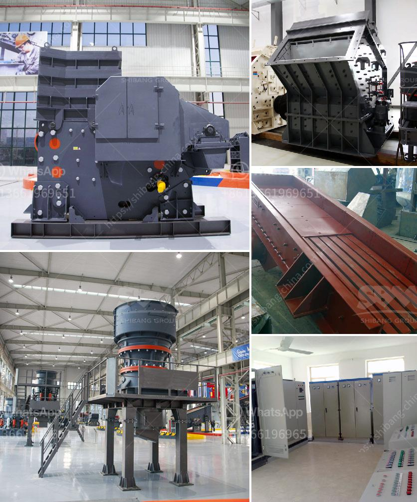

<h3>best jaw crusher for making stone</h3>
The jaw crusher is an essential piece of equipment when it comes to any stone crushing operation. The primary purpose of the jaw crusher is to break down the large stones into smaller pieces that are suitable for further processing. There are various types of jaw crushers available in the market, each designed with a different purpose in mind. In this article, we will explore the best jaw crusher for making stone, taking into account factors such as price, performance, and durability.

One of the best jaw crushers for making stone is the Nordberg C Series Jaw Crushers. These crushers are known for their reliability, efficiency, and high-quality end-product with cubicity. The Nordberg C Series Jaw Crushers are designed to crush efficiently all rock types, including the hardest granite and recycled materials.

The Nordberg C Series Jaw Crushers feature a unique pinned and bolted design that ensures optimal transportability and excellent fatigue strength. This design also allows for quick and easy maintenance, reducing downtime and improving productivity. Additionally, the jaw crushers in this series are equipped with a large feed opening, allowing them to handle even the largest stones effortlessly.

Another excellent option for stone crushing is the Metso Lokotrack® LT Series Jaw Crushers. These highly mobile jaw crushers offer fast setup and hydraulic adjustment to adapt to various crushing applications. The Lokotrack® LT Series Jaw Crushers are designed to crush hard rock and any recycled materials, making them ideal for contractors and quarry operators alike.

The Lokotrack® LT Series Jaw Crushers feature advanced hydraulics that ensure optimal performance and reliability. With a higher power rating and larger feed size, these jaw crushers are capable of handling high capacity and producing high-quality end-products. Whether it's gravel, recycled concrete, or granite, the Lokotrack® LT Series Jaw Crushers can efficiently process any material.

Finally, the Sandvik QJ341+ Jaw Crusher is another top choice for stone crushing applications. This powerful jaw crusher has been designed with the customer in mind, focusing on the key benefits of reliability, ease of operation, and minimal downtime. The Sandvik QJ341+ Jaw Crusher combines high performance with practical solutions for the most demanding quarrying and mining applications. 

The Sandvik QJ341+ Jaw Crusher features a powerful and aggressive crushing chamber, allowing it to produce excellent reduction ratios. The jaw crusher has a large feed opening, making it suitable for a wide variety of stone types and sizes. With its robust construction and high-quality components, the Sandvik QJ341+ Jaw Crusher offers exceptional reliability and durability.

In conclusion, choosing the best jaw crusher for making stone depends on various factors such as the desired product size, capacity, and application requirements. The Nordberg C Series Jaw Crushers, Metso Lokotrack® LT Series Jaw Crushers, and Sandvik QJ341+ Jaw Crusher are three excellent options to consider. These jaw crushers offer high performance, durability, and reliable operation, ensuring efficient stone crushing in every application.
<h3>Contact us</h3><ul><li><strong>Whatsapp:&nbsp;<a href="https://wa.me/8613661969651">+8613661969651</a></strong></li><li><a href="https://swt.shibang-china.com/?git&amp;zhl&amp;best jaw crusher for making stone"><strong>Online Service(chat now)</strong></a></li></ul><h3>Related</h3><ul><li><a href='distributor stone crusher machine indonesia.md'>distributor stone crusher machine indonesia</a></li><li><a href='rock quarry equipment for sale.md'>rock quarry equipment for sale</a></li><li><a href='chrome ore beneficiation plant in china.md'>chrome ore beneficiation plant in china</a></li><li><a href='tph stationery stone crushing plant.md'>tph stationery stone crushing plant</a></li><li><a href='barite crusher price.md'>barite crusher price</a></li></ul>