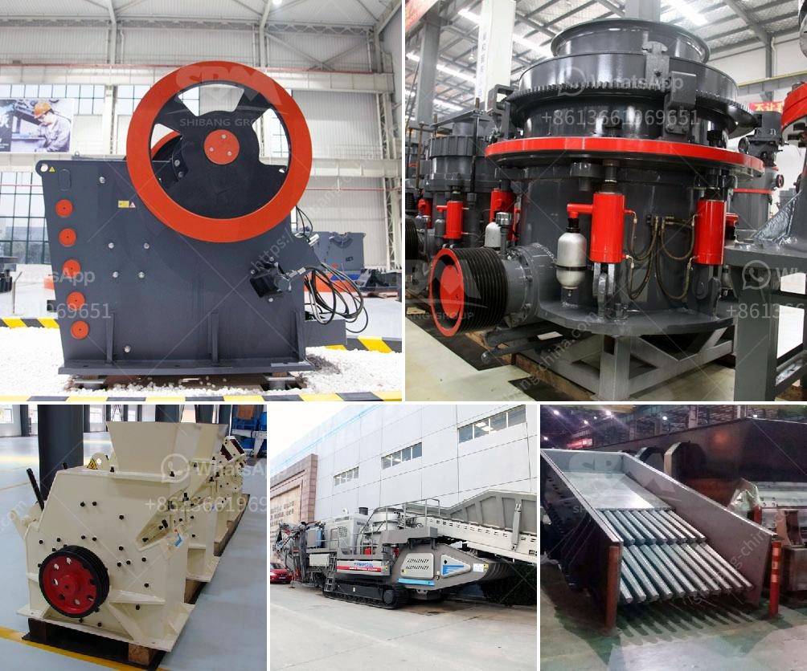

<h3>big stone crusher prices in south africa</h3>
Big stone crusher, also known as the name suggests, is a device that can crush large stones into smaller pieces. This article will explore the prices of big stone crusher in South Africa, including what should be the product quotation.

When purchasing big stone crushers, the price is a very important factor. We all know that stone crusher price directly determines the crusher's quality and performance. In South Africa, a big stone crusher price is relatively high, because the machines not only have high quality, but also have excellent performance.

The different stone crushers in the market have different prices, even the same type of crusher prices are different, so,we had better know what factors affect its price.

1. Production Cost Manufacturers need to invest technology, technology, manpower, material resources and time to arrange production. Therefore, the higher the production cost of the big stone crusher, the higher the price the manufacturer will sell it at.

2. Model Size There are various models of big stone crushers, some of which are relatively small, and some are large. In the market, the output of each model is different, so the price of each model is not the same, and the price of oversize stone crushers is generally higher than that of small and medium-sized stone crushers.

3. Brand Manufacturers that produce big stone crushers generally have a high reputation and good service. They have been committed to providing customers with reliable equipment and excellent after-sales service. Therefore, the price of big brand stone crushers is higher than that of ordinary small and medium-sized stone crushers.

In addition, the material and production process of the big stone crusher will also affect its price. Generally, the harder the material, the more difficult it is to break, and the more serious the wear of the equipment. Therefore, the price of big stone crusher made of hard material is higher than that of soft material.

When purchasing big stone crushers in South Africa, it is necessary to consider many factors, such as technology, quality, performance, supporting equipment, etc. It is suggested that you should do multiple comparisons and shop around to choose a suitable supplier to negotiate the price. Only in this way can you buy a suitable, cost-effective stone crusher.

In conclusion, the price of big stone crushers in South Africa is influenced by many factors, and the factors that affect the price are as follows: production cost, model size, brand, material, etc. If you want to get a specific quotation, please consult our customer service staff. They will have a professional quotation for you.
<h3>Contact us</h3><ul><li><strong>Whatsapp:&nbsp;<a href="https://wa.me/8613661969651">+8613661969651</a></strong></li><li><a href="https://swt.shibang-china.com/?git&amp;zhl&amp;big stone crusher prices in south africa"><strong>Online Service(chat now)</strong></a></li></ul><h3>Related</h3><ul><li><a href='small crusher project.md'>small crusher project</a></li><li><a href='crusher machinery from china.md'>crusher machinery from china</a></li><li><a href='supplier of jaw crusher in south africa.md'>supplier of jaw crusher in south africa</a></li><li><a href='pe jaw crusher stone jaw crusher for rock crushing.md'>pe jaw crusher stone jaw crusher for rock crushing</a></li><li><a href='ball mill in peru.md'>ball mill in peru</a></li></ul>