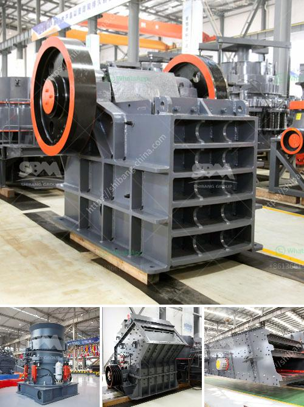

<h3>black granite land for sale in tamilnadu</h3>
Tamil Nadu, known as the Land of Temples, is not just famous for its rich cultural heritage, but also for its abundance of natural resources and mineral deposits. Among these, black granite stands out as a highly sought-after material for construction projects, monument production, and interior design. With increasing demand for this natural resource, investing in black granite land in Tamil Nadu has become an attractive option for real estate investors.

Tamil Nadu is one of the leading producers of black granite in India, with several quarries located in various parts of the state. These quarries contain vast reserves of high-quality black granite, characterized by its exquisite appearance and exceptional strength. The unique characteristics of this natural stone make it a preferred choice for architects, builders, and homeowners worldwide.

The black granite land for sale in Tamil Nadu presents a golden opportunity for investors to capitalize on the growing demand for this material. The favorable climate and geographical location of the state make it an ideal region for granite quarrying. In addition, the Tamil Nadu government has implemented policies and regulations to promote sustainable mining practices and ensure the conservation of natural resources.

Investing in black granite land in Tamil Nadu offers numerous advantages. Firstly, the demand for black granite is on the rise, both domestically and internationally. Rapid urbanization and infrastructural development projects have led to an increased need for high-quality construction materials, and black granite has emerged as a top choice for architects and developers. Therefore, owning a granite quarry in Tamil Nadu provides a steady source of income and long-term prospects for growth.

Secondly, the value of black granite land appreciates over time. As the availability of this natural resource decreases, the value of existing quarries and land holdings increases. This makes black granite land a lucrative investment option for those looking for a high return on their investment in the future.

Moreover, black granite is a highly durable and low-maintenance material. It is resistant to scratches, heat, and stains, making it suitable for various applications such as kitchen countertops, flooring, cladding, and monument production. Due to its timeless beauty and unmatched performance, black granite remains a popular choice among homeowners and designers.

When considering investing in black granite land in Tamil Nadu, it is important to conduct thorough research and due diligence. Engaging with experienced real estate agents who specialize in granite land can provide valuable insights into the market and help identify the most suitable properties for investment. It is also important to assess the infrastructure and accessibility of the land, as well as the legal aspects related to licensing and permits for quarry operations.

In conclusion, the availability of black granite land for sale in Tamil Nadu presents a promising opportunity for investors. With soaring demand for this natural resource, investing in black granite land offers a secure and rewarding investment option. However, it is crucial to approach the investment with proper research, expert advice, and adherence to legal requirements. With careful planning and consideration, investing in black granite land in Tamil Nadu can result in long-term benefits and substantial returns.
<h3>Contact us</h3><ul><li><strong>Whatsapp:&nbsp;<a href="https://wa.me/8613661969651">+8613661969651</a></strong></li><li><a href="https://swt.shibang-china.com/?git&amp;zhl&amp;black granite land for sale in tamilnadu"><strong>Online Service(chat now)</strong></a></li></ul><h3>Related</h3><ul><li><a href='sand making plant.md'>sand making plant</a></li><li><a href='crusher made in taiwan.md'>crusher made in taiwan</a></li><li><a href='impact crusher for sale in bulawayo.md'>impact crusher for sale in bulawayo</a></li><li><a href='coal processing plants for sale.md'>coal processing plants for sale</a></li><li><a href='raymond 5 roller mill.md'>raymond 5 roller mill</a></li></ul>