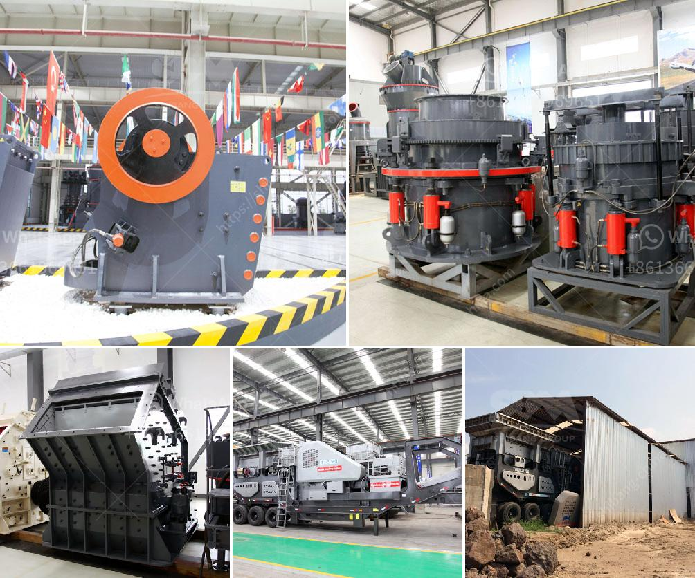

<h3>brand new stone crusher for sale in the philippines</h3>
The Philippines is a country rich in mineral resources. There are many large and small scale stone quarries in the local area, which produce various types of stones such as granite, limestone, and slate for construction purposes. With the increasing demand for stones in the construction industry, crusher machines are indispensable equipment in the mines and quarries.

Various types of stone crushers are used for crushing stones into various sizes, such as jaw crushers, impact crushers, cone crushers, and so on. These machines are usually used in the stone crushing plants for the production of aggregate materials, road construction, metallurgy, and other industries.

As the professional manufacturer and supplier of crusher machines in the Philippines, Aimix Group has developed various types of crusher machines for sale, such as jaw crusher, impact crusher, cone crusher, hammer crusher machines, and so on. These crusher machines can be used for limestone, granite, marble, basalt, iron ore, river stone, and other ores.

Moreover, Aimix's crushing machine has high quality and low price. Compared with other crusher machines, our crusher machine price is very reasonable and affordable. In addition, we will provide free installation and technical training. So if you are interested in our crusher machines, please contact us and we will give you a comprehensive introduction of our crusher machines.

The jaw crusher is a popular type of crusher used for crushing medium-hard to hard stones. It is widely used in construction, mining, metallurgy, and other industries. Jaw crusher has a compact design, high crushing ratio, simple structure, reliable performance, convenient maintenance, and low operation cost.

Another type of crusher machine commonly used is the impact crusher. It is characterized by a high reduction ratio and cubic shape of the final products. This machine is widely used in construction materials, coal, ore, cement manufacturing plants, and other industrial sectors. It can crush various materials such as limestone, granite, concrete, and so on.

Cone crusher machines are designed for secondary and tertiary crushing purposes. With advanced hydraulic technology, the machines feature high crushing efficiency, reliable performance, and increased production capacity. They are widely used in mining, metallurgy, building materials, and chemical industries.

In conclusion, the demand for stones in the Philippines is increasing, and crusher machines are indispensable equipment in the stone crushing plants. As a leading manufacturer and supplier of crusher machines, Aimix Group provides various types of crusher machines, such as jaw crusher, impact crusher, cone crusher, and so on. These machines have high quality and low price, and Aimix will provide excellent after-sales service and technical support.
<h3>Contact us</h3><ul><li><strong>Whatsapp:&nbsp;<a href="https://wa.me/8613661969651">+8613661969651</a></strong></li><li><a href="https://swt.shibang-china.com/?git&amp;zhl&amp;brand new stone crusher for sale in the philippines"><strong>Online Service(chat now)</strong></a></li></ul><h3>Related</h3><ul><li><a href='sand making machine roller mill.md'>sand making machine roller mill</a></li><li><a href='coal processing plants for sale.md'>coal processing plants for sale</a></li><li><a href='quarry stone crusher machine.md'>quarry stone crusher machine</a></li><li><a href='pakistan quarry crusher manufacturer.md'>pakistan quarry crusher manufacturer</a></li><li><a href='portable jaw crusher.md'>portable jaw crusher</a></li></ul>