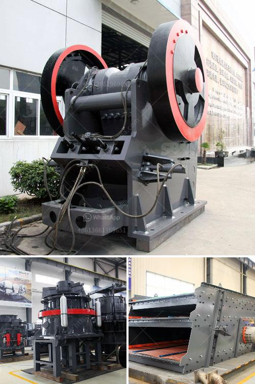

<h3>brazil best crusher manufacturing companies</h3>
Brazil, a country known for its expansive natural resources and vibrant culture, is experiencing a growing demand for crushers. As the country continues to delve into various industrial sectors, such as mining, construction, and energy, crushers have become an essential piece of equipment. To cater to this rising need, several companies have emerged as leaders in the manufacturing of crushers in Brazil. In this article, we will explore some of the best crusher manufacturing companies in Brazil.

One such company at the forefront of the crusher manufacturing industry in Brazil is Metso Outotec. With over a century of experience, Metso Outotec has established itself as a reliable supplier of crushers, delivering innovative solutions to its customers. Their crushers are known for their efficiency, durability, and performance, helping industries achieve their production goals. Moreover, Metso Outotec offers comprehensive after-sales support, ensuring that their customers receive the necessary assistance throughout the lifespan of their crushers.

Another prominent crusher manufacturing company in Brazil is Retsch. Retsch specializes in the production of laboratory crushers, providing top-of-the-line solutions for various research and development applications. Their crushers are designed to generate minimal contamination and achieve accurate particle size distribution, making them ideal for scientific experiments. Retsch values quality and precision, ensuring that their crushers meet the highest standards and deliver reliable results.

Sandvik, a global leader in mining equipment manufacturing, also has a strong presence in Brazil. The company offers a wide array of crushers, catering to different industries and applications. Whether it's mining, quarrying, or recycling, Sandvik crushers are designed to handle the toughest materials with ease. Sandvik prides itself on delivering cutting-edge technology and sustainable solutions, making them a popular choice among Brazilian industries.

Additionally, MB Crusher stands out as a Brazilian company that excels in crusher manufacturing. MB Crusher offers crushing solutions for various materials, including inert material, construction waste, concrete, and natural stone. Their crushers are designed to be easily transportable and adaptable to different working conditions, enabling industry professionals to efficiently crush materials on-site. MB Crusher prioritizes innovation, aiming to simplify processes and increase productivity for their customers.

In conclusion, Brazil's crusher manufacturing sector is filled with exceptional companies that provide high-quality and efficient crushers. Metso Outotec, Retsch, Sandvik, and MB Crusher are just a few examples of companies at the forefront of this industry. As Brazil continues its growth in various sectors, the demand for crushers is expected to increase. These manufacturing companies are prepared to meet this demand and offer reliable solutions to help industries achieve their goals. It is through their dedication to innovation, quality, and customer support that Brazil's best crusher manufacturing companies continue to thrive.
<h3>Contact us</h3><ul><li><strong>Whatsapp:&nbsp;<a href="https://wa.me/8613661969651">+8613661969651</a></strong></li><li><a href="https://swt.shibang-china.com/?git&amp;zhl&amp;brazil best crusher manufacturing companies"><strong>Online Service(chat now)</strong></a></li></ul><h3>Related</h3><ul><li><a href='gypsum crushing process.md'>gypsum crushing process</a></li><li><a href='diamond wash plants for sale in south africa.md'>diamond wash plants for sale in south africa</a></li><li><a href='mobile ball mill for small scale mining.md'>mobile ball mill for small scale mining</a></li><li><a href='raymond mill roll asembley.md'>raymond mill roll asembley</a></li><li><a href='how much is ballast crusher machine in kenya.md'>how much is ballast crusher machine in kenya</a></li></ul>