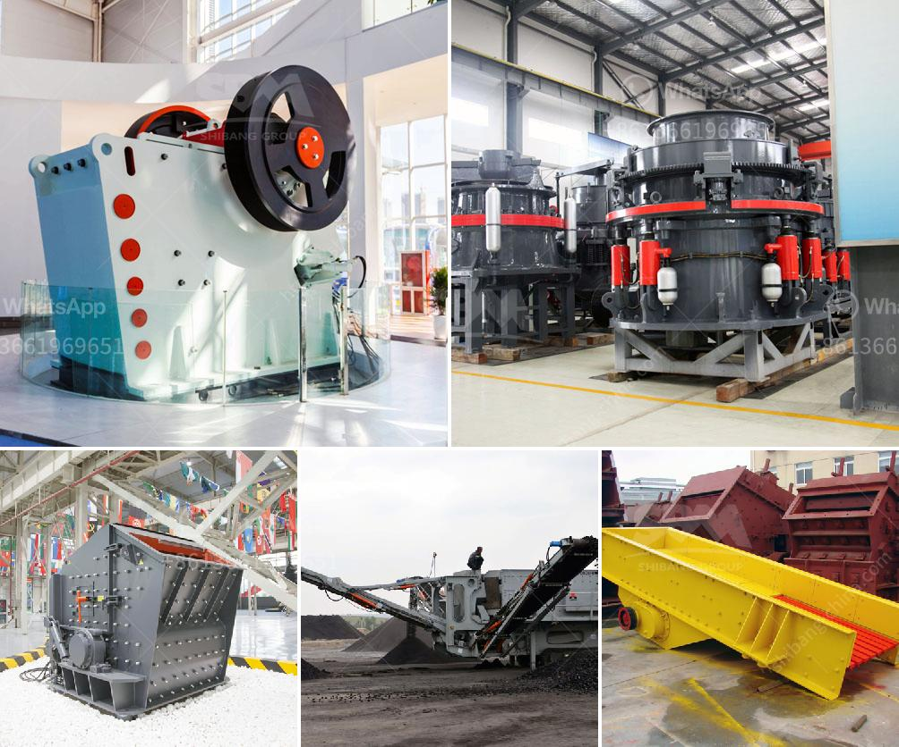

<h3>brick making machine for sale in south africa</h3>
South Africa, renowned for its vast mineral wealth, has been a hub of economic growth and development for decades. It is one of the leading countries in Africa, known for its progressive infrastructure and construction projects. With such a booming construction industry, the demand for bricks is at an all-time high. This makes investing in a brick making machine for sale in South Africa a lucrative opportunity.

A brick making machine is a versatile asset that can produce bricks of different sizes, shapes, and textures. These machines are designed to fulfill the requirements of construction companies and individuals looking to start their own brick-making business. Investing in a brick making machine allows the production of high-quality bricks at a faster rate and lower cost, thus increasing profitability.

South Africa is known for its rich clay deposits, making it an ideal location for producing bricks. By using locally sourced materials, the cost of production is significantly reduced, making the bricks more affordable for customers. Additionally, the ability to control the production process ensures superior quality and strength of the bricks, which is a key factor in the success of any construction project.

Furthermore, the versatility of the brick making machine allows for the production of a wide range of bricks, including interlocking bricks, paving bricks, hollow bricks, and more. These different types of bricks cater to various construction needs, making them highly marketable. South Africa's construction industry is growing rapidly, with a focus on sustainable and eco-friendly building practices. Investing in a brick making machine allows entrepreneurs to tap into this growing market.

There are many manufacturers and suppliers of brick making machines in South Africa, offering a variety of models to suit different budgets and production capacities. Some machines are fully automated, requiring minimal manual intervention, while others require more hands-on operation. Investing in a brick making machine with the right features and capabilities ensures optimal productivity and profitability.

In conclusion, investing in a brick making machine for sale in South Africa is a wise decision for entrepreneurs looking to capitalize on the booming construction industry. The availability of local raw materials, the ability to produce a variety of brick types, and the growing demand for sustainable construction practices make this investment opportunity highly attractive. With careful research and consideration, entrepreneurs can find the perfect brick making machine to meet their needs and set themselves up for success in the construction market.
<h3>Contact us</h3><ul><li><strong>Whatsapp:&nbsp;<a href="https://wa.me/8613661969651">+8613661969651</a></strong></li><li><a href="https://swt.shibang-china.com/?git&amp;zhl&amp;brick making machine for sale in south africa"><strong>Online Service(chat now)</strong></a></li></ul><h3>Related</h3><ul><li><a href='mobile jaw crusher for sale south africa.md'>mobile jaw crusher for sale south africa</a></li><li><a href='diatomite grinding mill in indonesia.md'>diatomite grinding mill in indonesia</a></li><li><a href='quartz marble making machine.md'>quartz marble making machine</a></li><li><a href='jaw crusher construction.md'>jaw crusher construction</a></li><li><a href='cement mill plant design drawings.md'>cement mill plant design drawings</a></li></ul>