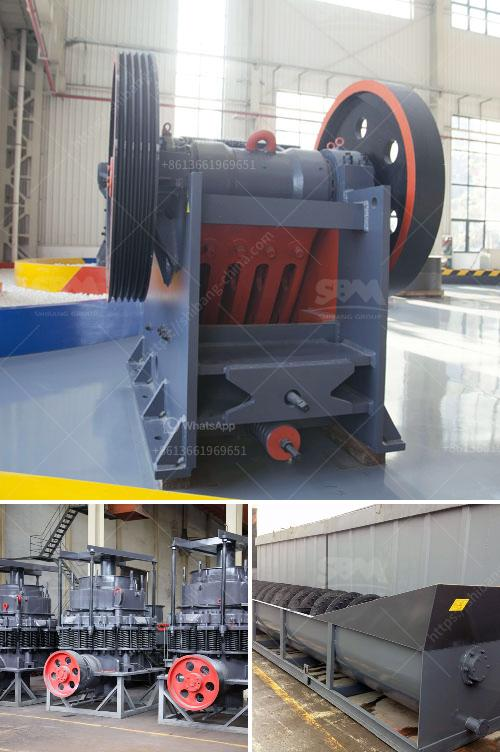

<h3>build vibrating screen</h3>
A vibrating screen is a mechanical tool used to separate various materials for commercial purposes. It efficiently and effectively sorts materials by size, allowing for further processing. With advancements in technology, designing and building a vibrating screen has become an accessible task.

To build a vibrating screen, one requires basic knowledge of welding and assembly processes. The screen surface, commonly made from wire mesh or perforated plates, is attached to a frame using springs, which allow it to vibrate freely. The vibrating motion separates the material into different sizes, ensuring efficient processing.

The first step in building a vibrating screen is to prepare the materials needed. This includes selecting the appropriate wire mesh or perforated plate, as well as the frame materials, springs, and motor. It is essential to choose sturdy and durable materials to ensure the screen's longevity.

Next, the frame needs to be constructed. This can be done by welding metal bars or using pre-made frame sections. The frame should be strong enough to support the vibrating screen without any distortion or movement during operation.

Once the frame is ready, the screen surface can be attached. The wire mesh or perforated plate should be cut to the appropriate size and then securely fastened to the frame. Care should be taken to ensure uniform tension across the entire screen surface for optimal screening performance.

After attaching the screen surface, the springs need to be installed. Springs play a vital role in allowing the screen to vibrate freely. They should be evenly distributed along the frame and tightened to the appropriate tension. This will enable the screen to efficiently separate materials based on size.

Finally, a motor should be mounted on the frame to provide the necessary vibrations. The motor should be positioned in a way that allows easy access for maintenance and adjustments.

In conclusion, building a vibrating screen requires a basic understanding of welding and assembly processes. By selecting suitable materials and following the necessary steps, it is possible to construct a vibrating screen that efficiently separates materials for commercial purposes.
<h3>Contact us</h3><ul><li><strong>Whatsapp:&nbsp;<a href="https://wa.me/8613661969651">+8613661969651</a></strong></li><li><a href="https://swt.shibang-china.com/?git&amp;zhl&amp;build vibrating screen"><strong>Online Service(chat now)</strong></a></li></ul><h3>Related</h3><ul><li><a href='basalt stone processing plant.md'>basalt stone processing plant</a></li><li><a href='iron ore beneficiation plant consultants in india.md'>iron ore beneficiation plant consultants in india</a></li><li><a href='gold milling equipment prices.md'>gold milling equipment prices</a></li><li><a href='manganese ore jaw crusher south africa.md'>manganese ore jaw crusher south africa</a></li><li><a href='feldspar ball mill porcess.md'>feldspar ball mill porcess</a></li></ul>