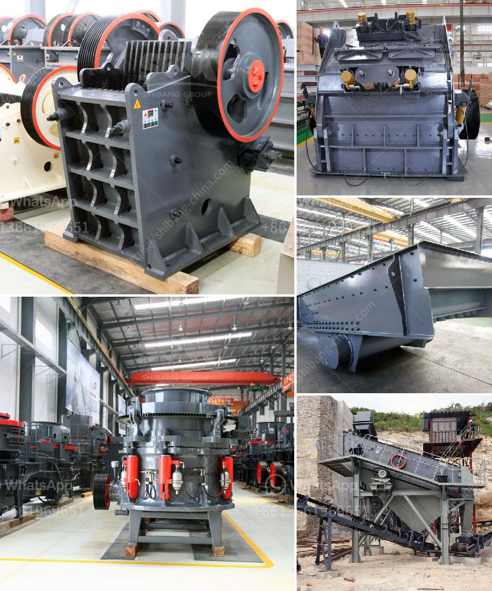

<h3>business plan for a cement plant</h3>
A business plan is a written document that outlines a company's goals, objectives, strategies, and financial projections for the future. It serves as a roadmap for the business, providing guidance on how to achieve success. For a cement plant, a comprehensive business plan is crucial, considering the capital-intensive nature and long-term commitments involved.

When developing a business plan for a cement plant, several key aspects need to be considered. Firstly, market analysis is vital. This involves understanding the demand and supply dynamics of cement in the target region. Factors such as population growth, construction activities, and infrastructure development play a significant role in determining market potential.

The business plan should also outline the plant's production capacity and technology. It should include details on the machinery and equipment required for the plant, as well as the source of raw materials. Additionally, considerations for environmental regulations and sustainability practices must be incorporated to showcase responsible and ethical operations.

Financial projections are a critical component of the business plan. This should include estimates of revenue, expenses, and profits over a specific timeframe. It should highlight the expected return on investment and the payback period, considering the initial investment required for land, buildings, machinery, and working capital.

Furthermore, a business plan should address marketing and sales strategies. This includes identifying the target customer base and outlining strategies to reach and attract them. The plan should discuss pricing strategies, distribution channels, and promotional activities to effectively position the cement plant in the market.

Lastly, the business plan should include a comprehensive risk assessment and mitigation plan. This will help identify potential risks and develop strategies to minimize their impact on the business. Risks such as fluctuating raw material prices, competition, regulatory changes, and economic uncertainties should be addressed.

In conclusion, a well-prepared business plan is essential for a cement plant as it provides a blueprint for success. By conducting a thorough market analysis, outlining production capacity and technology, projecting financials, implementing marketing strategies, and addressing risks, the business plan sets the stage for a sustainable and profitable cement plant operation.
<h3>Contact us</h3><ul><li><strong>Whatsapp:&nbsp;<a href="https://wa.me/8613661969651">+8613661969651</a></strong></li><li><a href="https://swt.shibang-china.com/?git&amp;zhl&amp;business plan for a cement plant"><strong>Online Service(chat now)</strong></a></li></ul><h3>Related</h3><ul><li><a href='quarry crusher in kenya.md'>quarry crusher in kenya</a></li><li><a href='stone crusher price in india.md'>stone crusher price in india</a></li><li><a href='raymond mill operation.md'>raymond mill operation</a></li><li><a href='small scale verticle grinding limestone machine.md'>small scale verticle grinding limestone machine</a></li><li><a href='roller mill for gravel.md'>roller mill for gravel</a></li></ul>