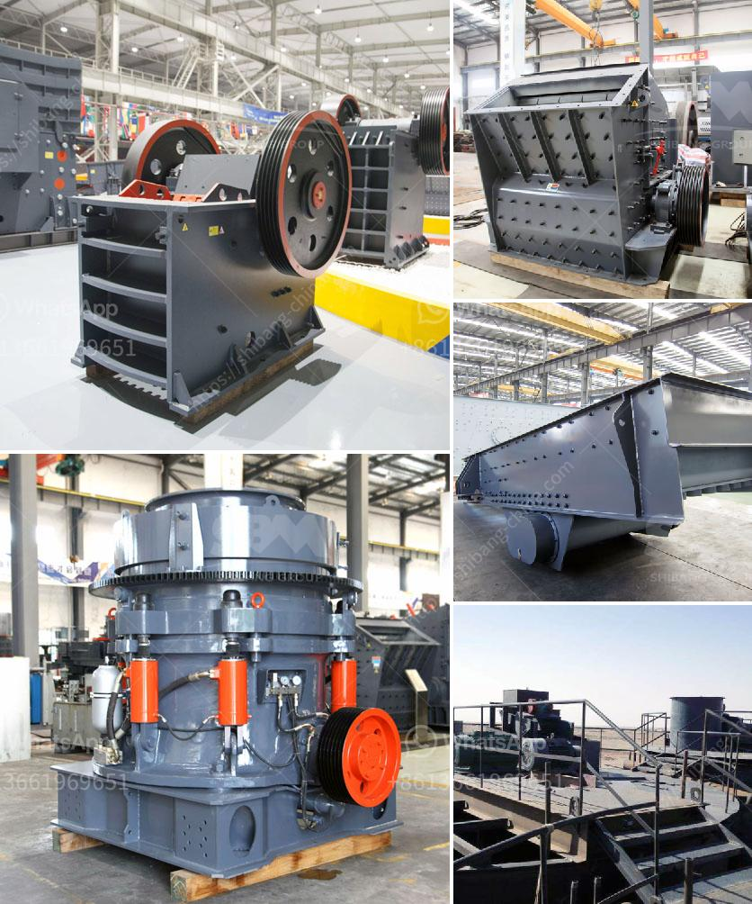

<h3>business plan on quarry crusher</h3>
A quarry crusher business plan is a lucrative business that needs a lot of strategic planning to start and a business coach like dayo adetiloye to help you start the implementation. Business Description of Quarry Crusher Plant

Creating a business plan for a quarry crusher plant is an essential document that you need to possess because it will help you obtain necessary funds for starting the business. It is required for the complete planning and establishment of a successful quarry crusher plant.

A quarry business requires a substantial initial investment to set up the production facility. The setup must include a large gravel deposit on-site to justify the expense of equipment. Some potential investors have mistakenly equated the necessary funding with their main expense, which is a grave misconception. Often, the actual cost is far beyond the equipment, transportation, and extraction costs.

The first obligation is to scope out the plant material permits needed for mining rights, with a sensible plan layout including major elevations at the base of a mountain. A quarry inventory is essential for extracting volumes coincident to the granite outcrop to avoid overlapping and large setbacks. A proper environmental assessment includes land erosion prevention, stormwater management, and water treatment equipment if applicable.

Once the quarry crusher plant plan has been completed, the actual plant has to be installed and the actual construction and installation costs come into play. The as-built construction costs are obtained by completing a take-off of everything required to install not only the plant but any required roads, fences, storage facilities, conveyors, leach pads, tailings dams, or other facilities. This will give a reasonably close estimate of the plant’s cost, including any equipment, systems, piping or other consumables, and any other materials or services required for the quarry crusher plant.

A proper quarry crusher plant business plan will automatically ensure compliance with local regulations as well as federal and state laws. It will protect the environment and increase your chances of obtaining any necessary environmental permits required for your quarryplan.

In summary, building a quarry crusher business plan is a profitable and highly strategic endeavor. It involves plenty of logistical planning and understanding of the agricultural landscape you plan on operating. Finding a suitable location and securing the necessary permits and licenses is a time-consuming process. However, with patience and perseverance, the rewards can be ample.
<h3>Contact us</h3><ul><li><strong>Whatsapp:&nbsp;<a href="https://wa.me/8613661969651">+8613661969651</a></strong></li><li><a href="https://swt.shibang-china.com/?git&amp;zhl&amp;business plan on quarry crusher"><strong>Online Service(chat now)</strong></a></li></ul><h3>Related</h3><ul><li><a href='sand making machine saudi.md'>sand making machine saudi</a></li><li><a href='construction equipment manufacturer in turkey.md'>construction equipment manufacturer in turkey</a></li><li><a href='crushed aggregates supplier in negros.md'>crushed aggregates supplier in negros</a></li><li><a href='grinding and sorting equipment sand gravel.md'>grinding and sorting equipment sand gravel</a></li><li><a href='quarry and stone crushing executive business plan.md'>quarry and stone crushing executive business plan</a></li></ul>