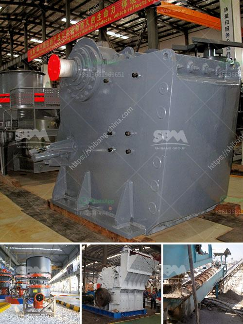

<h3>buy 450 kw stone crusher</h3>
Are you in need of a powerful stone crusher to crush rocks, stones, or minerals effectively? Look no further, as we present to you the exceptional 450 KW stone crusher, designed to fulfill all your crushing requirements. With its staggering power and robust design, this crusher is a game-changer in the industry.

The 450 KW stone crusher boasts a high capacity and efficiency, making it capable of processing large quantities of material in a short amount of time. Its advanced crushing technology ensures that each stone is crushed to the desired size, leaving no room for inefficiency. Whether you are involved in mining, quarrying, or construction, this crusher is the perfect addition to your equipment fleet.

What sets this stone crusher apart from the rest is its versatility. It can effortlessly handle various types of materials, including granite, basalt, limestone, and more. With adjustable settings, you can easily achieve your desired output size, making it suitable for a range of applications. From road construction to concrete production, this crusher has got you covered.

Safety is of utmost importance in any crushing operation, and the 450 KW stone crusher is equipped with advanced safety features to ensure the well-being of operators. From its automatic lubrication system to its emergency stop buttons, every aspect of this crusher is designed with safety in mind.

Durability is another key factor to consider when purchasing a stone crusher, and this 450 KW model is built to last. Made from high-quality materials and constructed with precision, it can withstand the toughest of conditions. Its robust design ensures that it can handle heavy-duty tasks without any performance setbacks.

In conclusion, if you require a crusher that delivers tremendous power, versatility, safety, and durability, look no further than the 450 KW stone crusher. It is the ultimate solution for companies in the mining, construction, and quarrying industries. Invest in this crusher, and you will witness enhanced productivity, reduced downtime, and exceptional crushing performance.
<h3>Contact us</h3><ul><li><strong>Whatsapp:&nbsp;<a href="https://wa.me/8613661969651">+8613661969651</a></strong></li><li><a href="https://swt.shibang-china.com/?git&amp;zhl&amp;buy 450 kw stone crusher"><strong>Online Service(chat now)</strong></a></li></ul><h3>Related</h3><ul><li><a href='quarry dust in concrete sand making stone quarry.md'>quarry dust in concrete sand making stone quarry</a></li><li><a href='talc grinding mills usa.md'>talc grinding mills usa</a></li><li><a href='crusher machine for sale south africa.md'>crusher machine for sale south africa</a></li><li><a href='cara kerja mesin pemecah batu stone crusher.md'>cara kerja mesin pemecah batu stone crusher</a></li><li><a href='companies that sell conveyor belts.md'>companies that sell conveyor belts</a></li></ul>