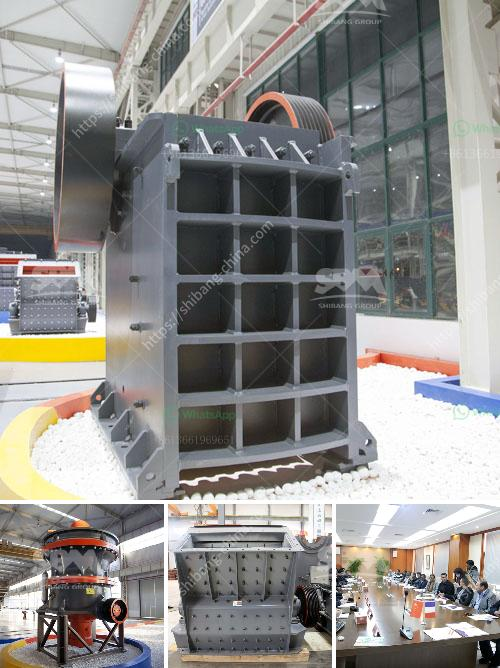

<h3>buy crusher of pact in peru</h3>
Peru, a country known for its rich history and diverse landscapes, has been attracting a growing number of tourists and adventurers in recent years. With its ancient ruins, vibrant culture, and stunning natural beauty, visiting Peru is on many travelers' bucket lists. Whether you are exploring the mystical Machu Picchu or indulging in culinary delights in Lima, Peru has something for everyone. However, to make the most of your trip, it is crucial to have the right equipment, and that includes a crusher of compact.

A crusher of compact, also known as a mini crusher or mini gravity mill, is an essential tool for anyone looking to extract minerals or crush rocks during their exploration adventures in Peru. Its compact size and mobility make it perfect for remote locations and rough terrains. It can be easily transported and operated, even in the narrowest spaces, allowing you to crush rocks on the spot and extract valuable materials without the need for expensive or time-consuming transportation.

Peru is renowned for its abundance of mineral resources, including silver, copper, gold, and zinc. Nestled in the Andes Mountains, the country is home to numerous mining sites that have been operating for centuries. Whether you are a professional miner or a hobbyist looking to try your luck, having a crusher of compact will greatly enhance your mining experience. With its ability to crush rocks and separate minerals, it will save you time and effort, providing you with a way to process the raw materials right where you find them.

Furthermore, Peru's diverse landscapes offer plenty of opportunities for adventure-seekers and nature enthusiasts. From the Amazon rainforest to the high Andes, there are plenty of rocks and minerals to explore and collect. Whether you are searching for fossils, gemstones, or simply curious about the unique geology of the region, a crusher of compact will allow you to break down rocks and examine them more closely. Its portable design enables you to go off the beaten path and explore remote areas, uncovering hidden treasures along the way.

When purchasing a crusher of compact in Peru, it is essential to consider a few factors. Firstly, ensure that the crusher is powerful enough to handle the type of rocks you will encounter. Different crushers have varying capacities, so select one that suits your specific needs. Additionally, consider the crusher's mobility features, such as its weight, size, and ease of transportation. Peru's rugged terrains require a crusher that can withstand rough conditions and still deliver optimal performance.

Fortunately, there are various suppliers in Peru offering crushers of compact designed for mining and exploration purposes. Researching reputable suppliers and comparing their products and customer reviews will help you find the right crusher for your needs. Consider factors such as durability, efficiency, and warranty when making a purchase. Additionally, inquire about available customer support and spare parts, as these will be crucial during your exploration endeavors in Peru.

In conclusion, buying a crusher of compact in Peru is an investment that can significantly enhance your exploration and mining experiences. Its ability to crush rocks and extract minerals right where they are found provides you with a valuable tool for efficient and self-sustaining operations. With Peru's abundance of natural resources and stunning landscapes, having a crusher of compact will allow you to make the most of your adventures in this beautiful country.
<h3>Contact us</h3><ul><li><strong>Whatsapp:&nbsp;<a href="https://wa.me/8613661969651">+8613661969651</a></strong></li><li><a href="https://swt.shibang-china.com/?git&amp;zhl&amp;buy crusher of pact in peru"><strong>Online Service(chat now)</strong></a></li></ul><h3>Related</h3><ul><li><a href='aggregate washing plant for sale.md'>aggregate washing plant for sale</a></li><li><a href='granite crusher machine companies.md'>granite crusher machine companies</a></li><li><a href='stone crusher in uk.md'>stone crusher in uk</a></li><li><a href='20 ton peru mobile crushing plant.md'>20 ton peru mobile crushing plant</a></li><li><a href='xzm ultrafine grinding mill.md'>xzm ultrafine grinding mill</a></li></ul>