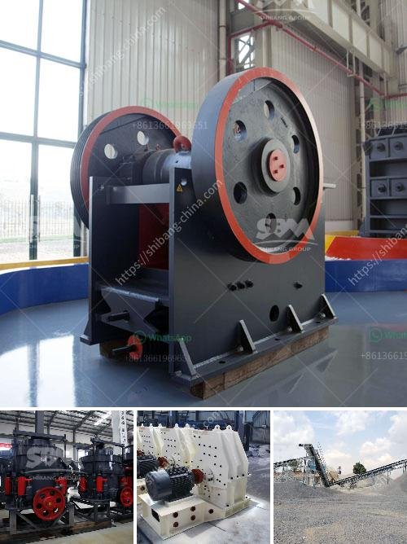

<h3>buy fine grinding machine</h3>
If you are in the manufacturing or industrial sector, you are most likely aware of the importance of having the right equipment and machinery to ensure a smooth and efficient production process. When it comes to grinding, a fine grinding machine is a crucial tool that can significantly enhance productivity and accuracy.

Fine grinding machines are designed to achieve the highest precision and surface quality, making them ideal for applications where tight tolerances and fine finishes are required. Whether you are in the metalworking, automotive, aerospace, or any other industry that relies on precise grinding, investing in a fine grinding machine is a smart choice.

One of the major advantages of using a fine grinding machine is its ability to remove material at a microscopic level, resulting in a smoother finish and more accurate dimensions. This ensures that the final product meets the required specifications, reducing the need for additional finishing processes and saving time and resources.

Furthermore, fine grinding machines are built with advanced technology and features that allow for exceptional control and flexibility. With adjustable speed, pressure, and grinding parameters, operators can customize the process to suit the specific requirements of each job, achieving optimal results every time.

Another key benefit of investing in a fine grinding machine is the potential cost savings it can bring. By improving efficiency and reducing the need for post-processing, manufacturers can save on labor costs and minimize material waste. Additionally, having an in-house fine grinding machine eliminates the need to outsource this process, further reducing expenses and lead times.

When considering buying a fine grinding machine, it is essential to choose a reputable manufacturer that offers high-quality equipment. Look for machines that are built to last, with durable components and a robust construction. Additionally, ensure that the machine is easy to operate and maintain, with user-friendly interfaces and clear documentation.

In conclusion, a fine grinding machine is a valuable investment for any manufacturing or industrial business. With its ability to achieve precision, accuracy, and superior surface quality, it can significantly enhance productivity and reduce production costs. Whether you are grinding metal, ceramics, or other materials, a fine grinding machine can make a world of difference in your operations. So, don't hesitate to explore your options and choose the right machine to take your production to the next level.
<h3>Contact us</h3><ul><li><strong>Whatsapp:&nbsp;<a href="https://wa.me/8613661969651">+8613661969651</a></strong></li><li><a href="https://swt.shibang-china.com/?git&amp;zhl&amp;buy fine grinding machine"><strong>Online Service(chat now)</strong></a></li></ul><h3>Related</h3><ul><li><a href='station mobile de lavage de diamants.md'>station mobile de lavage de diamants</a></li><li><a href='mobile crusher on hire in tamil nadu.md'>mobile crusher on hire in tamil nadu</a></li><li><a href='artificial stone manufacturing process.md'>artificial stone manufacturing process</a></li><li><a href='crusher machine factories in coimbatore.md'>crusher machine factories in coimbatore</a></li><li><a href='used cone crushers zambia.md'>used cone crushers zambia</a></li></ul>