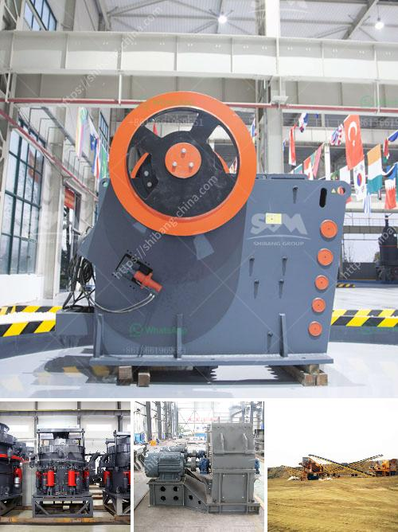

<h3>buy jaw crusher machine</h3>
The modern mining and construction industries heavily rely on efficient equipment to ensure smooth operations and maximize productivity. One such indispensable machine is the jaw crusher, which plays a vital role in processing raw materials into usable materials. In this article, we will explore the benefits of investing in a jaw crusher machine, highlighting its key features and how it can revolutionize your operations.

-------------------------------------------------------------------------------------------------------------------

A jaw crusher machine is a primary crushing unit used for reducing the size of various materials to smaller, manageable chunks. It features a stationary jaw plate and a movable jaw plate that provide excellent crushing capabilities. The materials are fed into the jaws, where compressive force is applied to break them down into smaller particles. This robust machine is exceptionally versatile, making it ideal for crushing a wide range of materials, including hard rocks, ores, and concrete.

Investing in a jaw crusher machine offers numerous advantages that can significantly improve your mining or construction operations:

a. Higher production capacity: Jaw crushers can handle larger feed sizes compared to other crushing equipment, resulting in increased output and productivity.

b. Uniform product size: The adjustable gap between the jaws allows for precise control over the final product size, ensuring uniformity and consistency.

c. Energy efficiency: Jaw crushers are designed to consume less energy while delivering high crushing efficiency and reducing the overall operational cost.

d. Durability and reliability: Jaw crusher machines are built to withstand harsh environments and heavy-duty applications, minimizing downtime and maintenance requirements.

When considering purchasing a jaw crusher machine, pay attention to the following features that can enhance its overall performance:

a. Heavy-duty construction: Look for a robust frame and high-grade components that can withstand extreme conditions and prolonged use.

b. Efficient operating mechanism: Opt for a machine with a reliable hydraulic system to ease the adjustment of jaw settings and prevent overloading.

c. User-friendly design: A well-designed jaw crusher machine should be easy to operate and maintain, minimizing training requirements and optimizing efficiency.

d. Customizable options: Consider machines offering adjustable jaw settings, multiple nip angles, and versatile discharge options that suit your specific needs.

In today's fast-paced mining and construction industries, investing in a high-quality jaw crusher machine can significantly enhance your operations. With its unrivaled ability to break down materials efficiently, handle a wide range of applications, and deliver consistent results, a jaw crusher machine becomes an invaluable asset to any business aspiring to succeed in these sectors.
<h3>Contact us</h3><ul><li><strong>Whatsapp:&nbsp;<a href="https://wa.me/8613661969651">+8613661969651</a></strong></li><li><a href="https://swt.shibang-china.com/?git&amp;zhl&amp;buy jaw crusher machine"><strong>Online Service(chat now)</strong></a></li></ul><h3>Related</h3><ul><li><a href='crusher supplier pakistan.md'>crusher supplier pakistan</a></li><li><a href='small slag crushing plant manufacturers in delhi.md'>small slag crushing plant manufacturers in delhi</a></li><li><a href='barite powder making.md'>barite powder making</a></li><li><a href='100 tph cobble crushing plant.md'>100 tph cobble crushing plant</a></li><li><a href='clay mill roller balancing.md'>clay mill roller balancing</a></li></ul>