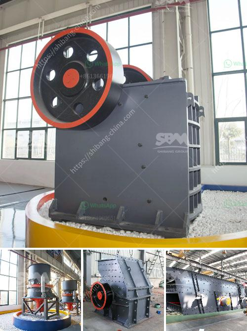

<h3>buy the stone crusher function of 1100</h3>
Stone crushers are extensively used to crush bulk and heavy stones into different sizes efficiently and reliably, be it for road construction, building, bridges or other infrastructures. Stone crushing is a primary task in mine quarrying and construction industry, and traditional stone crushing generally uses several types of crushing plants to set up a stone crushing plant. The commonly used equipment in a stone crushing plant includes jaw crusher, impact crusher, vertical shaft impact crusher and vibrating screen. The machines are connected with belt conveyor.

Setting up a stone crushing plant requires high investment and then the function of the stone crusher is important. Why do we need crusher in stone crushing plant? In fact, crushing plants have different functions. The most basic function is to take large stone elements from the quarry, later being reduced in size by a primary and sometimes a secondary crusher, fixed or mobile crusher.

Jaw crushers break large stones into smaller ones. These smaller stones are then actually transported by the conveyor and fed into crushers such as the impact crusher or VSI crusher. These stone crushers have high efficiency and the machine is able to complete the required tasks effectively.

On the other hand, the impact crusher also acts as a secondary crushing machine, since the processed material is normally not small enough for cone crushers — secondary crushing also crushes stone into smaller sizes where it can fit through the hole of the crushed stone screens.

Vertical shaft impact crusher functions as a powerful crushing machine, as this machine works by breaking stones against surfaces in order to produce cubes, plates, or other shapes of high-quality materials.

The vibrating screen separates crushed stones according to their size, and the stones with larger size will be returned to the impact crusher for further crushing.

Buying a stone crusher 1100 with a capacity of 300 to 500 tons per hour is a wise choice for operational flexibility. For example, you could use it for the initial stages of your projects when your budget doesn't allow you to invest in a large crusher. It could help you to crush broken stones in smaller sizes so that you can proceed with your project smoothly.

Furthermore, the stone crusher 1100 with 300 to 500 ton capacity is also suitable for smaller-scale construction jobs. There might be certain situations where it's not economical to rent larger crushing machines, but you still need to crush the stones on-site. In such cases, the stone crusher 1100 would be a perfect choice as it offers excellent mobility, ease of operation, and high efficiency in a compact size.

In conclusion, buying a stone crusher 1100 with a capacity of 300 to 500 tons per hour allows you to benefit from operational flexibility, cost-effectiveness, and high-quality crushed stones necessary in various construction projects. Whether you are working on large-scale projects or smaller-scale construction jobs, investing in a stone crusher 1100 will prove to be a worthy decision.
<h3>Contact us</h3><ul><li><strong>Whatsapp:&nbsp;<a href="https://wa.me/8613661969651">+8613661969651</a></strong></li><li><a href="https://swt.shibang-china.com/?git&amp;zhl&amp;buy the stone crusher function of 1100"><strong>Online Service(chat now)</strong></a></li></ul><h3>Related</h3><ul><li><a href='coal crusherton per hours.md'>coal crusherton per hours</a></li><li><a href='mobile stone crusher plant on hire in india.md'>mobile stone crusher plant on hire in india</a></li><li><a href='staalmeester hammer mills.md'>staalmeester hammer mills</a></li><li><a href='crushing machine in.md'>crushing machine in</a></li><li><a href='small used jaw crusher ebay.md'>small used jaw crusher ebay</a></li></ul>