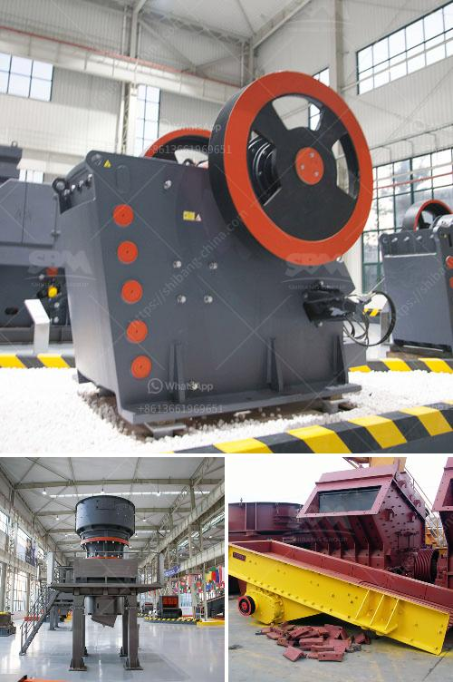

<h3>buy used crushing coal screen plant</h3>
If you are in the market for a used crushing coal screen plant, there are many factors to consider before making your purchase. One of the most important aspects is the reliability of the machine. A plant that has been well-maintained and has a proven track record of efficiently crushing coal is essential for continuous operation.

When buying used coal crushing equipment, it is crucial to inspect the condition of the plant thoroughly. Look for signs of wear and tear, such as rust or damage to the structure. Check the belts and screens for any signs of damage or excessive wear. It is also important to assess the overall cleanliness of the plant, as this can be indicative of how well it has been maintained.

Another important consideration is the capacity of the crushing plant. Determine how much coal you need to process per hour and choose a plant that can handle that capacity. It is also important to ensure that the plant is compatible with your existing infrastructure and can be easily integrated into your operations.

Price is another factor that needs to be taken into account. Used crushing coal screen plants can vary widely in price, depending on the brand, model, and condition of the equipment. It is always a good idea to compare prices from different sellers and consider any additional costs, such as transportation and installation.

Additionally, it is advisable to research the reputation of the seller. Look for reviews from other customers who have purchased used crushing coal screen plants from the same seller. This will give you an idea of their reliability and customer service.

Overall, buying a used crushing coal screen plant can be a cost-effective solution for your coal processing needs. However, it is crucial to thoroughly inspect the equipment, consider the capacity requirements, and compare prices before making your final decision. By doing your due diligence, you can ensure that you are purchasing a reliable plant that will meet your production needs efficiently.
<h3>Contact us</h3><ul><li><strong>Whatsapp:&nbsp;<a href="https://wa.me/8613661969651">+8613661969651</a></strong></li><li><a href="https://swt.shibang-china.com/?git&amp;zhl&amp;buy used crushing coal screen plant"><strong>Online Service(chat now)</strong></a></li></ul><h3>Related</h3><ul><li><a href='cost of stone crusher production line in china.md'>cost of stone crusher production line in china</a></li><li><a href='power of a hammer mill.md'>power of a hammer mill</a></li><li><a href='mining equipment chrome concentrates in turkey.md'>mining equipment chrome concentrates in turkey</a></li><li><a href='gravel screeners for sale craigslist.md'>gravel screeners for sale craigslist</a></li><li><a href='business plan for a cement plant.md'>business plan for a cement plant</a></li></ul>