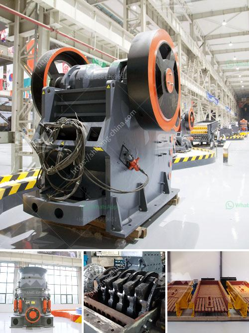

<h3>calcite mining equipment</h3>
Calcite is a calcium carbonate mineral, also known as limestone in its purest form. Calcite is a common mineral found in sedimentary rocks, and its crystal shape is diverse with usually six-sided prism-like structures. Calcite has a wide range of applications, especially in the construction and mining industries. Calcite mining equipment plays a crucial role in ensuring the smooth operation of various construction and mining projects.

Furthermore, calcite mining equipment is essential because calcite can be used in various industries, such as cement and paper making. It is also used as a soil conditioner, making it an essential part of agriculture. Calcite can even be used as a flux in glass and ceramic manufacturing.

To efficiently extract calcite from the earth, specialized mining machinery and equipment are needed. The basic equipment includes crushers, conveyors, and screens. These machines are designed to reduce the size of calcite ores and facilitate easy transportation. Once the calcite ores have been crushed, the next step is to separate the raw material from impurities. This separation process involves the use of various techniques, such as flotation and magnetic separation.

Flotation is a widely used technique in the mining industry to separate minerals from gangue. In the case of calcite, the flotation process involves using chemicals that selectively bind to the calcite particles, making them float while leaving impurities behind. Magnetic separation, on the other hand, utilizes magnetic properties to separate calcite from other minerals. This technique is particularly useful when dealing with minerals that have different magnetic properties.

In addition to the separation process, calcite mining equipment also includes drying equipment. After calcite ores have been extracted and processed, they need to be dried before they can be used in various industries. This is because wet calcite can cause operational issues and affect the quality of the final product. Drying equipment, such as rotary dryers, is used to remove moisture from the calcite, ensuring optimal performance and quality.

Calcite mining equipment is not just limited to machinery. It also includes safety gear and devices to protect workers. Mining operations can be hazardous, and it is essential to prioritize the safety of workers. Protective gear, such as helmets, gloves, and goggles, provides essential protection against potential risks. Additionally, safety devices, such as gas detectors and fire suppression systems, help prevent accidents and ensure a safe working environment.

In conclusion, calcite mining equipment is crucial for the extraction and processing of calcite ores. It ensures the smooth operation of mining projects and enables the utilization of calcite in various industries. From crushers to flotation machines, drying equipment to safety gear, calcite mining equipment encompasses a wide range of machinery and devices that play a vital role in the calcite mining process. With the right equipment, calcite mining can be carried out efficiently and safely, contributing to economic growth and technological advancements.
<h3>Contact us</h3><ul><li><strong>Whatsapp:&nbsp;<a href="https://wa.me/8613661969651">+8613661969651</a></strong></li><li><a href="https://swt.shibang-china.com/?git&amp;zhl&amp;calcite mining equipment"><strong>Online Service(chat now)</strong></a></li></ul><h3>Related</h3><ul><li><a href='industrial rotary dryers for sale india.md'>industrial rotary dryers for sale india</a></li><li><a href='100tpd cement plant project cost.md'>100tpd cement plant project cost</a></li><li><a href='feasibility on quarry business.md'>feasibility on quarry business</a></li><li><a href='gypsum board manufacturing machine india.md'>gypsum board manufacturing machine india</a></li><li><a href='uses of stone crusher equipment pdf.md'>uses of stone crusher equipment pdf</a></li></ul>