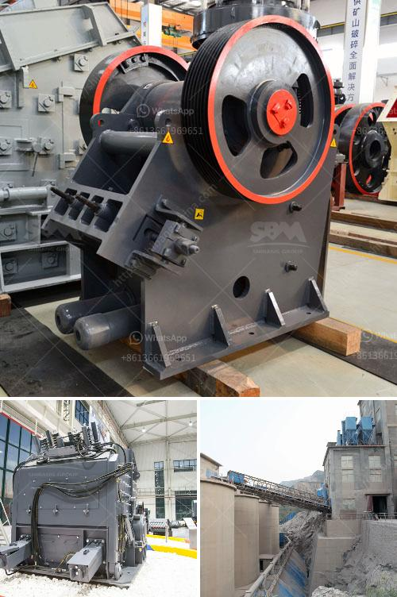

<h3>calcium carbonate manufacturing process</h3>
Calcium carbonate is a compound composed of calcium atoms bonded to carbonate ions. It is one of the most common and versatile minerals on the planet, found in rocks, sediment, and the shells of marine organisms. Calcium carbonate has a wide range of applications, from making building materials, to agriculture, to pharmaceuticals and cosmetics. In this article, we will explore the manufacturing process of calcium carbonate.

There are two main types of calcium carbonate used in industrial applications: ground calcium carbonate (GCC) and precipitated calcium carbonate (PCC). The manufacturing processes for these two forms differ, but both are derived from limestone, a sedimentary rock composed primarily of calcium carbonate.

In the GCC manufacturing process, limestone is extracted from quarries and then crushed and ground into a fine powder. The resulting calcium carbonate is classified based on particle size and further processed through a series of specialized equipment to create various grades of GCC. These grades are used in a variety of applications, including the production of paper, paint, plastics, and rubber.

The PCC manufacturing process, on the other hand, starts with the extraction of limestone, which is then heated to high temperatures to produce lime (calcium oxide). The lime is then slaked with water to produce slaked lime (calcium hydroxide). Carbon dioxide gas is bubbled through the slaked lime, causing calcium carbonate to precipitate out of solution. The resulting precipitated calcium carbonate is filtered, dried, and ground into a fine powder.

PCC has a narrower particle size distribution compared to GCC, making it an ideal filler material for applications where smoothness and brightness are desired, such as in the production of paper, paints, and coatings. Additionally, PCC can be surface treated to improve its properties, such as its dispersibility and rheology.

The manufacturing process for both GCC and PCC involves careful quality control to ensure the final product meets stringent specifications. Particle size, whiteness, brightness, and chemical composition are all closely monitored. In addition, the selection of high-quality limestone as the raw material is crucial to producing calcium carbonate with consistent quality and performance characteristics.

The demand for calcium carbonate continues to grow as industries rely on it for a wide range of applications. Manufacturers are investing in research and development to explore new production methods and uses for calcium carbonate. For example, some companies are investigating ways to harness carbon dioxide emissions from industrial processes and convert them into calcium carbonate through mineral carbonation, a process that mimics natural weathering reactions that occur over millions of years.

In conclusion, the manufacturing process of calcium carbonate involves extracting limestone and then processing it to produce either ground calcium carbonate (GCC) or precipitated calcium carbonate (PCC). Both forms of calcium carbonate have diverse industrial applications and are produced with stringent quality control measures. As industries continue to innovate, the demand for calcium carbonate is expected to remain strong, driving further advancements in its production and usage.
<h3>Contact us</h3><ul><li><strong>Whatsapp:&nbsp;<a href="https://wa.me/8613661969651">+8613661969651</a></strong></li><li><a href="https://swt.shibang-china.com/?git&amp;zhl&amp;calcium carbonate manufacturing process"><strong>Online Service(chat now)</strong></a></li></ul><h3>Related</h3><ul><li><a href='build vibrating screen.md'>build vibrating screen</a></li><li><a href='mini jaw crusher for sale used.md'>mini jaw crusher for sale used</a></li><li><a href='small scale coal processing plant.md'>small scale coal processing plant</a></li><li><a href='feasibility study of palm kernel crushing plant.md'>feasibility study of palm kernel crushing plant</a></li><li><a href='mobile roller crushers in south africa.md'>mobile roller crushers in south africa</a></li></ul>