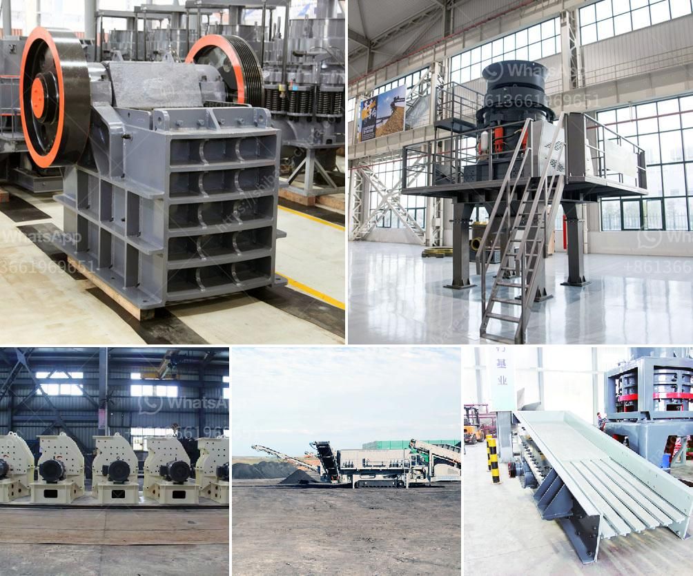

<h3>calcium carbonate micronized plants</h3>
Calcium carbonate micronized plants are used in various industries for manufacturing products like paints, coatings, plastics, paper, and many others. Micronized calcium carbonate refers to a fine powder form of calcium carbonate that has undergone a precise milling process.

These plants are designed to produce high-quality calcium carbonate with a narrow particle size distribution and a high level of purity. The micronization process involves grinding calcium carbonate particles to a size of less than 10 microns, resulting in a finely powdered product that offers several advantages.

One of the main benefits of using micronized calcium carbonate is its enhanced dispersibility in different mediums. The fine particles ensure a more uniform distribution throughout the material, leading to improved performance and consistency in the end product.

Another advantage is the increased surface area that micronized calcium carbonate offers. This allows for better interaction with other compounds, resulting in improved chemical reactions and enhanced properties of the final product.

Calcium carbonate micronized plants also play a crucial role in environmental sustainability. The high-quality calcium carbonate produced can be used in substitution of more environmentally harmful materials, reducing the overall carbon footprint of industries. Additionally, calcium carbonate is known for its ability to absorb carbon dioxide and help mitigate climate change.

Overall, calcium carbonate micronized plants are indispensable in many industries due to the unique properties it imparts to various products. The precise milling process allows for the production of high-quality, finely powdered calcium carbonate, offering improved dispersibility, increased surface area, and enhanced environmental sustainability. As industries continue to prioritize efficiency and sustainability, these plants will undoubtedly remain vital in manufacturing processes worldwide.
<h3>Contact us</h3><ul><li><strong>Whatsapp:&nbsp;<a href="https://wa.me/8613661969651">+8613661969651</a></strong></li><li><a href="https://swt.shibang-china.com/?git&amp;zhl&amp;calcium carbonate micronized plants"><strong>Online Service(chat now)</strong></a></li></ul><h3>Related</h3><ul><li><a href='cement plant production line.md'>cement plant production line</a></li><li><a href='hammer mill impactor marble machina.md'>hammer mill impactor marble machina</a></li><li><a href='gypsum mining crusher dubai.md'>gypsum mining crusher dubai</a></li><li><a href='jaw crusher for sale in harare.md'>jaw crusher for sale in harare</a></li><li><a href='quartz plant manufacturing process.md'>quartz plant manufacturing process</a></li></ul>