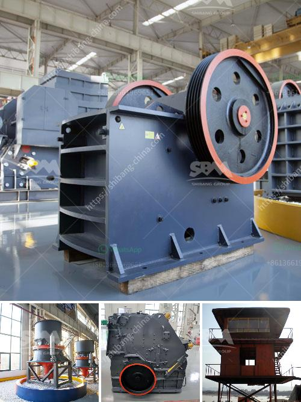

<h3>calcium carbonate powder making</h3>
Calcium carbonate is a common compound found in rocks, shells, and pearls. It is an essential mineral that is used in a wide range of applications, from building materials to healthcare products. One of the most common forms of calcium carbonate is its powdered form, which is created through a process known as calcium carbonate powder making.

The process of calcium carbonate powder making starts with the mining of limestone, a sedimentary rock composed primarily of calcium carbonate deposits. Limestone is extracted from mines and quarries through blasting or cutting. It is then crushed into smaller pieces and transported to a rock grinding mill.

At the mill, large grinding machines called crushers reduce the limestone to a fine powder. This powder is then mixed with water to form a slurry. The slurry goes through a series of screens to remove any impurities and achieve the desired particle size.

After the screening process, the slurry is sent to a centrifuge, where it undergoes centrifugal separation. This separates the water from the calcium carbonate, leaving behind a damp powder. The powder is then dried using a rotary dryer, which removes any remaining moisture.

The dried calcium carbonate is then transported to a classification unit, where it is sorted into different grades based on particle size. The classification process ensures that the calcium carbonate powder meets the specific requirements of different industries.

Calcium carbonate powder has a wide range of applications. In the construction industry, it is used as a filler in concrete and as a component in the production of bricks, tiles, and roofing materials. Its fine particle size and chemical properties make it an excellent additive for improving the strength and durability of construction materials.

In the food and pharmaceutical industries, calcium carbonate powder is used as a dietary supplement and an antacid. It is also used as an ingredient in baking powder, toothpaste, and other oral care products. Its ability to neutralize excess stomach acid makes it a popular ingredient in over-the-counter antacid medications.

In the manufacturing industry, calcium carbonate powder is used as a raw material for the production of paints, coatings, and plastic materials. Its high whiteness and opacity make it an ideal filler in the production of paper, providing brightness and smoothness to the finished product.

Additionally, calcium carbonate powder is also used in environmental applications. It is used as a pH regulator in water treatment processes, helping to neutralize acidic or alkaline water. It is also used in the purification of flue gases produced by industrial processes, reducing harmful emissions and promoting air quality.

Overall, calcium carbonate powder making is a crucial process that transforms a raw material into a versatile product with various applications. Whether in construction, healthcare, manufacturing, or environmental industries, calcium carbonate powder plays a vital role in enhancing the quality and performance of different products.

With its abundance, affordability, and diverse applications, calcium carbonate powder remains a valuable mineral in multiple industries, contributing to technological advancements and improving our everyday lives.
<h3>Contact us</h3><ul><li><strong>Whatsapp:&nbsp;<a href="https://wa.me/8613661969651">+8613661969651</a></strong></li><li><a href="https://swt.shibang-china.com/?git&amp;zhl&amp;calcium carbonate powder making"><strong>Online Service(chat now)</strong></a></li></ul><h3>Related</h3><ul><li><a href='ball mill 3 ton.md'>ball mill 3 ton</a></li><li><a href='limestone mining crusher industry in nepal.md'>limestone mining crusher industry in nepal</a></li><li><a href='concrete cube crushing machine price.md'>concrete cube crushing machine price</a></li><li><a href='20 ton peru mobile crushing plant.md'>20 ton peru mobile crushing plant</a></li><li><a href='crusher machine factories in coimbatore.md'>crusher machine factories in coimbatore</a></li></ul>