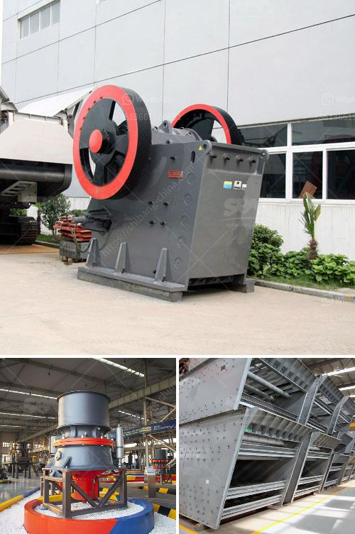

<h3>calculate output of aggregate crushing plant</h3>
Calculating the output of an aggregate crushing plant is not an easy task. This is because the particle size distribution of the products obtained from crushing various materials differs significantly. Therefore, in order to accurately estimate the output of the plant, it is necessary to have a good understanding of the material being crushed, the parameters of the crushing equipment, and the operating conditions of the plant.

Firstly, it is important to analyze the material being crushed. Different materials have different properties and therefore require different crushing methods. For example, soft and brittle materials can be effectively crushed using a jaw crusher, while materials with high hardness may require a cone crusher or impact crusher. Understanding the properties of the material will help determine the appropriate crushing equipment to use.

Secondly, the parameters of the crushing equipment must be taken into account. The capacity of the crusher, the speed at which the material is fed into the crushing chamber, the power consumption, and the size distribution of the crushed product all play a significant role in determining the output of the plant. It is important to choose the right equipment and set the parameters correctly in order to optimize the output.

Finally, the operating conditions of the plant also affect the output. Factors such as the availability and quality of the feed material, the efficiency of the screening process, and the maintenance and operating practices of the plant can all impact the output. It is important to regularly monitor and adjust these factors to ensure maximum productivity.

In conclusion, calculating the output of an aggregate crushing plant requires a combination of materials knowledge, equipment parameters, and operating conditions. By understanding these factors and continuously monitoring and adjusting them, the plant can achieve optimum output levels.
<h3>Contact us</h3><ul><li><strong>Whatsapp:&nbsp;<a href="https://wa.me/8613661969651">+8613661969651</a></strong></li><li><a href="https://swt.shibang-china.com/?git&amp;zhl&amp;calculate output of aggregate crushing plant"><strong>Online Service(chat now)</strong></a></li></ul><h3>Related</h3><ul><li><a href='tonne mobile crusher for sale philippines.md'>tonne mobile crusher for sale philippines</a></li><li><a href='price of ballast per ton in kenya.md'>price of ballast per ton in kenya</a></li><li><a href='fortius roller mill.md'>fortius roller mill</a></li><li><a href='ballast making machine for sale.md'>ballast making machine for sale</a></li><li><a href='sand washing equipment for sale.md'>sand washing equipment for sale</a></li></ul>