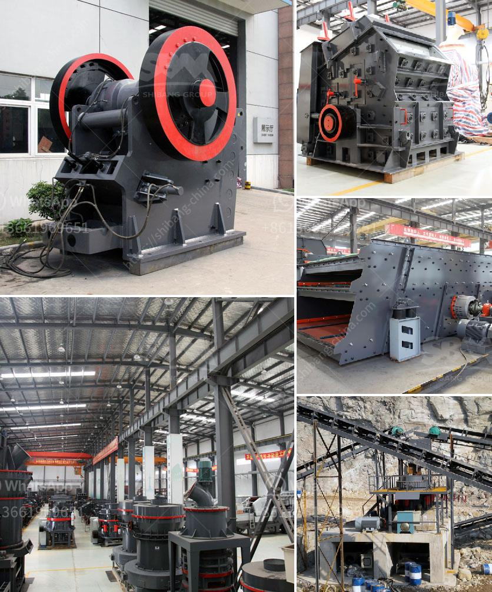

<h3>calculation crusher plant cost</h3>
When it comes to calculating the cost of a crushing plant, there are numerous factors to consider. These include both the initial cost of the equipment and the operational costs associated with running the plant.

The fundamental goal for any crushing plant is to produce the required material sizes at the lowest cost per ton. With this in mind, it’s important that the design of the crushing plant allows for efficient operation and maintenance to ensure the maximum return on investment.

Calculating the upfront cost of a crushing plant is not an exact science. There are different variables to consider, such as the type of equipment being used, the capacity of the plant, and the required final product specification. This will determine the size and type of crushers, screens, and conveyors required.

Operational costs are equally important to consider. These costs include labor, fuel, maintenance expenses, and electricity consumption. Designing a plant with energy-efficient equipment can help reduce electricity costs, while regular maintenance can prevent breakdowns and costly repairs.

Additionally, the location of the plant can impact the cost. Transportation costs may increase if the plant is located far from the source of raw materials, as this would require longer hauling distances.

To accurately calculate the cost of a crushing plant, it’s crucial to gather all relevant information and consult with experts in the field. This includes obtaining quotes from reputable equipment suppliers, conducting feasibility studies, and analyzing production requirements.

In conclusion, calculating the cost of a crushing plant involves a careful analysis of numerous factors. By considering both the initial cost of the equipment and the operational expenses, plant owners can make informed decisions that will ultimately lead to a cost-effective and profitable crushing operation.
<h3>Contact us</h3><ul><li><strong>Whatsapp:&nbsp;<a href="https://wa.me/8613661969651">+8613661969651</a></strong></li><li><a href="https://swt.shibang-china.com/?git&amp;zhl&amp;calculation crusher plant cost"><strong>Online Service(chat now)</strong></a></li></ul><h3>Related</h3><ul><li><a href='companies that sell conveyor belts.md'>companies that sell conveyor belts</a></li><li><a href='buy 450 kw stone crusher.md'>buy 450 kw stone crusher</a></li><li><a href='gold stamping mill prices in south africa.md'>gold stamping mill prices in south africa</a></li><li><a href='sayaji jaw crusher vadodara.md'>sayaji jaw crusher vadodara</a></li><li><a href='jaw crusher for sale in harare.md'>jaw crusher for sale in harare</a></li></ul>