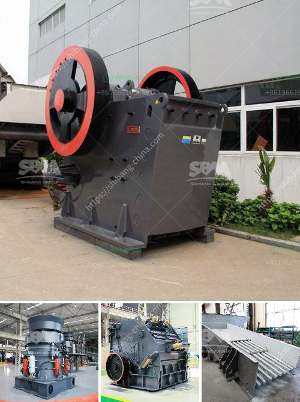

<h3>calculation of cement ball mill capacity</h3>
Cement ball mill is used to grind crushed cement clinker, gypsum rock, coal etc. for cement plant. Cement mill in cement production line is of low cost, high capacity etc. Limestone Grinding Mills to Supply 200~325mesh limestone powder for Cement Industry:

Raw material grinding has the objective of producing a homogenous raw meal from a number of components that are sometimes variable in themselves. The feed of the mill must be made in such a way that the mill does not empty itself but also does not overflow. The feed is the “life-blood” of the mill. In the earlier motion of grinding, the mill is assumed to be perfectly mixed, with size of material homogeneous in each bin.

In the packing liners the higher gradation inside the ball mill, the improved mill air classification and inclusion for grinding systems making regional adjustments ,etc can be improved by using a particle control feed grinding machines

The present work deals with the estimation of the grinding efficiency of a clinker batch in a continuous cement ball mill. This estimation indicates no significant increase in both clinker flotation rate and the load of the mill, which may prevent excessive increase in mill capacity until a certain degree of fineness is achieved. This is mainly due to the fact that the size distribution of the clinker clinker feed is more closely monitored in a ball mill than in a high-pressure roller mill. In a ball mill, gradation changes continuously as fine particles are progressively discharged as a result of breakup of particles.

The velocity and pressure of the fluid in the friction technique vary along the ball mill. Also, the boundary conditions at the outlet of the ball mill are not constant, as in a high-pressure roller mill. This means that the mill capacity decreases as the mill pressure increases, which in turn reduces the air rotation and flow, resulting in a decrease in the circulating load to the mill.

A production plant from corn cobs would be a low-cost item. However, it needs to be further investigated whether the necessary modifications can be implemented in this system with the necessary modification of the mill, and which will be the most appropriate raw material for the cement plant.

In the cement plants, continuous mills are used with an air flow of approximately 0.8 m^3/s and with a static pressure drop, from the ball mill, approaching the highest optimum pressure for the available particle size range of the cement. Thus, if the static pressure of the boiler is the same as in a dry-grinding ball mill, the mill pressure for ball mills will also increase by 0.8 m^3/s. 

Therefore, by using the maximum pressure which can be measured, 9.8 MPa, in continuous application, a higher solidification rate and a higher static pressure to the mill can be reached, thus substantially improving the mill capacity.

In conclusion, the capacity of the cement ball mill can be significantly increased by adding grinding aids in the clinker grinding process. However, considering the economic aspects of the process, adding grinding aids in the ball mill grinding process is the most attractive option. Thus, in the design and operation of the cement ball mill, the calculation of cement ball mill capacity should be appropriate and reasonable.

Overall, the cement ball mill has a narrow particle size distribution and can achieve a grinding efficiency rate of about 10 times higher than traditional mills. With a more consistent product quality and lower energy consumption, cement ball mills are increasingly being used in the cement industry.
<h3>Contact us</h3><ul><li><strong>Whatsapp:&nbsp;<a href="https://wa.me/8613661969651">+8613661969651</a></strong></li><li><a href="https://swt.shibang-china.com/?git&amp;zhl&amp;calculation of cement ball mill capacity"><strong>Online Service(chat now)</strong></a></li></ul><h3>Related</h3><ul><li><a href='product of 100 tons mini cement plant.md'>product of 100 tons mini cement plant</a></li><li><a href='small scale gold cip processing.md'>small scale gold cip processing</a></li><li><a href='grinding machines for zinc stearate.md'>grinding machines for zinc stearate</a></li><li><a href='talc grinding mills usa.md'>talc grinding mills usa</a></li><li><a href='price of mobile crusher in the philippines.md'>price of mobile crusher in the philippines</a></li></ul>