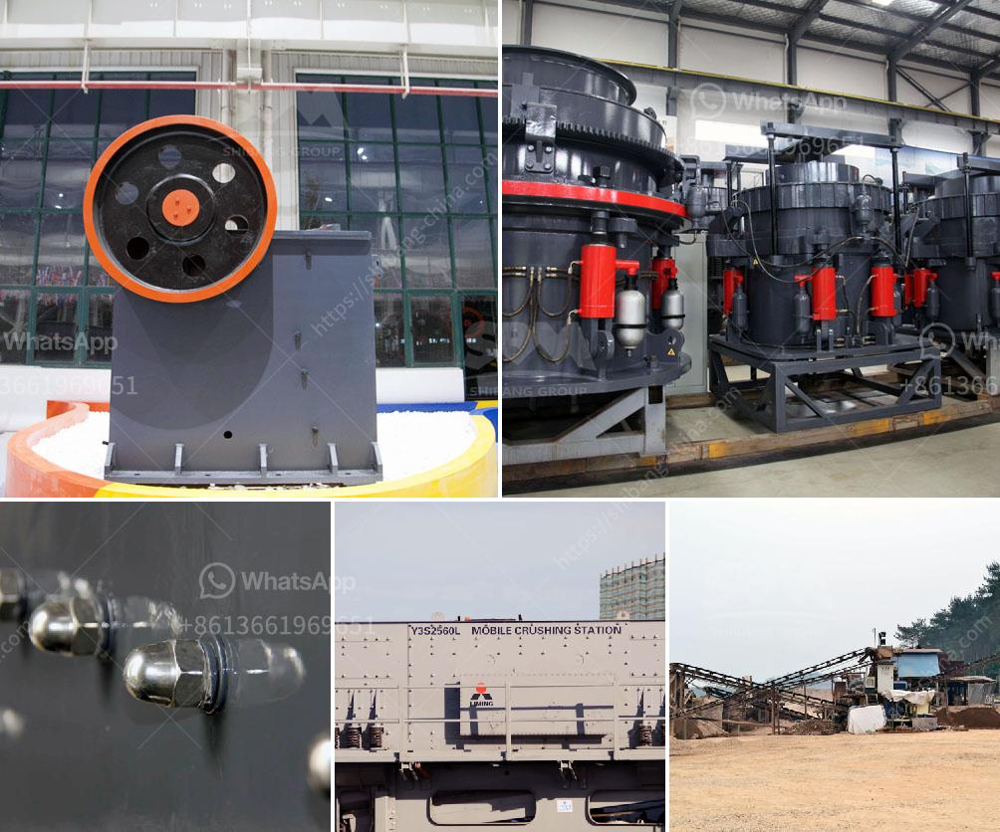

<h3>calculation of torque of hammer mill</h3>
The torque of a rotating object, such as a hammer mill, is an indicator of its ability to perform work. When the power supply is limited, a higher torque will give the machine the necessary power to handle tough materials. But how is torque calculated for a hammer mill?

Before diving into the calculation process, let's first understand what a hammer mill is. A hammer mill is a machine used for grinding or shredding different materials into smaller pieces. This crushing action is accomplished by moving hammers attached to a rotor, which turns at high speed inside a cylindrical casing. The material is fed into the mill through a hopper and then milled into the desired size by the repeated blows of the hammers.

1. Rotor speed: The rotational speed of the rotor is a crucial parameter that determines the velocity at which the hammers strike the material. Generally, a higher rotor speed translates into higher torque, as the hammers hit more frequently and with greater force.

2. Hammer design: The size, shape, and weight distribution of the hammers also play a role in determining the torque. Heavier hammers will generate more torque, while the shape and size will impact the force and impact area during each strike.

3. Hammermill size: The overall size of the hammer mill will have an impact on the torque generated. A larger mill generally has more mass and inertia, resulting in higher torque requirements to start and maintain operation.

4. Material properties: The properties of the material being milled, such as its density, hardness, and moisture content, can impact the torque needed. Harder and denser materials may require more torque to effectively break them down.

To calculate the torque, a basic formula can be used, called torque = power / angular velocity. In the case of a hammer mill, power is typically measured in horsepower (HP), and angular velocity is measured in RPM (rotations per minute). Therefore, the formula becomes torque (in inch-pounds) = HP x 63,052 / RPM.

However, this simplified formula does not take into account other variables, such as the hammer design, material properties, and hammermill size. For a more accurate calculation, it is recommended to consult the manufacturer's specifications, which often provide torque ratings for specific models.

In conclusion, calculating the torque of a hammer mill involves considering various factors, including rotor speed, hammer design, mill size, and material properties. While a simplified formula can be used, it is essential to consult the manufacturer's specifications for accurate torque calculations. By understanding the torque requirements, operators can ensure the hammer mill has enough power to handle the desired workload efficiently.
<h3>Contact us</h3><ul><li><strong>Whatsapp:&nbsp;<a href="https://wa.me/8613661969651">+8613661969651</a></strong></li><li><a href="https://swt.shibang-china.com/?git&amp;zhl&amp;calculation of torque of hammer mill"><strong>Online Service(chat now)</strong></a></li></ul><h3>Related</h3><ul><li><a href='second hand ball mill for sale in philippines.md'>second hand ball mill for sale in philippines</a></li><li><a href='small scale aggregate crushing machine.md'>small scale aggregate crushing machine</a></li><li><a href='conveyor belts in horizontal position.md'>conveyor belts in horizontal position</a></li><li><a href='ball mill small for sale.md'>ball mill small for sale</a></li><li><a href='used lab scale crusher price.md'>used lab scale crusher price</a></li></ul>