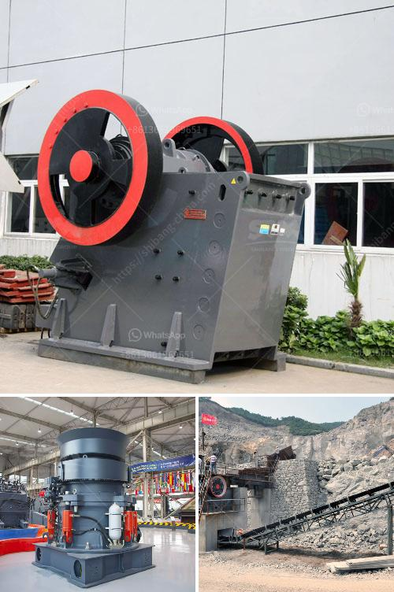

<h3>cameroon quarry crusher</h3>
Cameroon, located in Central Africa, is a country rich in natural resources such as oil, gas, and minerals. With its booming construction industry, quarrying and stone crushing play an important role in the economy. As a result, there has been a tremendous increase in the demand for quarrying machinery such as stone crushers.

A quarry crusher is a machine used to break or compress stones into smaller pieces or fine gravel. The extracted materials are used for construction purposes, road building, and landscaping. With the continuous growth of the construction industry, the demand for quarry crushers in Cameroon is constantly on the rise.

One of the main advantages of using a quarry crusher is its ability to produce a wide range of sizes of crushed stone. This versatility allows builders to effectively meet the specific requirements of their projects. Additionally, the crushed stones can be used immediately, eliminating the need for further processing.

Cameroon quarry crushers are also known for their high productivity levels. This is mainly due to the robust design and superior performance of these machines. With powerful motors and durable components, quarry crushers can process large quantities of stone in a short amount of time. This significantly improves operational efficiency and reduces the overall construction time.

Another benefit of quarry crushers is their ability to handle various types of materials. Whether it's granite, limestone, or sandstone, these machines can effectively crush and process different rock types. This versatility allows construction companies to work on a wide range of projects without needing multiple crushers for different materials.

In conclusion, quarry crushers are a vital tool in the construction industry in Cameroon. Their ability to produce different sizes of crushed stone, their high productivity levels, and versatility make them a crucial piece of equipment for any construction project. With the continuous growth in the construction industry, the demand for quarry crushers in Cameroon is expected to remain high.
<h3>Contact us</h3><ul><li><strong>Whatsapp:&nbsp;<a href="https://wa.me/8613661969651">+8613661969651</a></strong></li><li><a href="https://swt.shibang-china.com/?git&amp;zhl&amp;cameroon quarry crusher"><strong>Online Service(chat now)</strong></a></li></ul><h3>Related</h3><ul><li><a href='granite crusher machine companies.md'>granite crusher machine companies</a></li><li><a href='secondary rock crusher.md'>secondary rock crusher</a></li><li><a href='used stone crushers for sale from uae.md'>used stone crushers for sale from uae</a></li><li><a href='ball mill for lead processing companies list.md'>ball mill for lead processing companies list</a></li><li><a href='components of a ball mill.md'>components of a ball mill</a></li></ul>