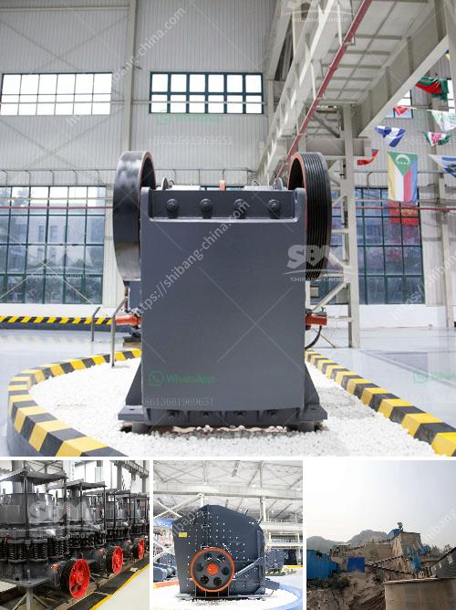

<h3>canadia crusher portable chassis</h3>
In today's fast-paced construction industry, efficiency and productivity are of utmost importance. With tight schedules and strict deadlines, contractors are constantly on the lookout for equipment that can help them get the job done faster and more efficiently. One such equipment that has been gaining a lot of attention in recent years is the Canadia Crusher Portable Chassis.

The Canadia Crusher Portable Chassis is a revolutionary piece of equipment that has completely transformed the way construction projects are undertaken. This highly adaptable and versatile machine has become a game-changer in the industry, providing contractors with the ability to crush materials on-site, eliminating the need for transportation to and from a separate crushing plant.

One of the standout features of the Canadia Crusher Portable Chassis is its mobility. With a compact and lightweight design, this equipment can easily be transported to various job sites, even those located in remote areas. This eliminates the need for multiple trucks and machinery, resulting in significant cost savings for contractors. Additionally, the portable nature of the chassis ensures minimal setup time, allowing workers to get started on the project almost immediately.

Another key advantage of the Canadia Crusher Portable Chassis is its ability to crush various materials. Whether it's concrete, asphalt, or even rocks, this equipment can easily handle them all. By crushing materials on-site, contractors no longer need to rely on external suppliers, thereby reducing dependency and potential delays in the project. Moreover, crushed materials can be reused for various purposes, such as road base or aggregate, further contributing to cost savings and promoting sustainability.

The Canadia Crusher Portable Chassis is designed to be user-friendly and efficient. Equipped with advanced features and controls, operators can easily adjust the settings to achieve the desired size and consistency of the crushed materials. This promotes better quality control, resulting in superior end products. The machine's high processing capacity ensures a continuous flow of crushed materials, thereby preventing any bottlenecks in the construction process.

Furthermore, the Canadia Crusher Portable Chassis is built with durability in mind. Constructed from high-quality materials, this equipment can withstand the harshest of environments and heavy-duty usage. Its robust design ensures long-term reliability, reducing the need for frequent repairs and replacements. This, in turn, minimizes downtime and maximizes productivity at the job site.

In conclusion, the Canadia Crusher Portable Chassis has revolutionized the construction industry. Its mobility, versatility, and efficiency have made it an indispensable piece of equipment for contractors across the globe. The ability to crush materials on-site, combined with its user-friendly controls and durability, has made it a go-to choice for numerous projects. With the Canadia Crusher Portable Chassis, contractors can significantly enhance their productivity, reduce costs, and streamline their construction processes. As the industry continues to evolve, the Canadia Crusher Portable Chassis serves as a testament to innovation and progress, offering solutions that are poised to shape the future of construction.
<h3>Contact us</h3><ul><li><strong>Whatsapp:&nbsp;<a href="https://wa.me/8613661969651">+8613661969651</a></strong></li><li><a href="https://swt.shibang-china.com/?git&amp;zhl&amp;canadia crusher portable chassis"><strong>Online Service(chat now)</strong></a></li></ul><h3>Related</h3><ul><li><a href='copper crusher exporter in south africa.md'>copper crusher exporter in south africa</a></li><li><a href='mobile crusher machine price.md'>mobile crusher machine price</a></li><li><a href='jaw crusher pe 250 x 400.md'>jaw crusher pe 250 x 400</a></li><li><a href='carbonate grinding plant feasibility study.md'>carbonate grinding plant feasibility study</a></li><li><a href='how much is a crusher mincer in malaysia.md'>how much is a crusher mincer in malaysia</a></li></ul>