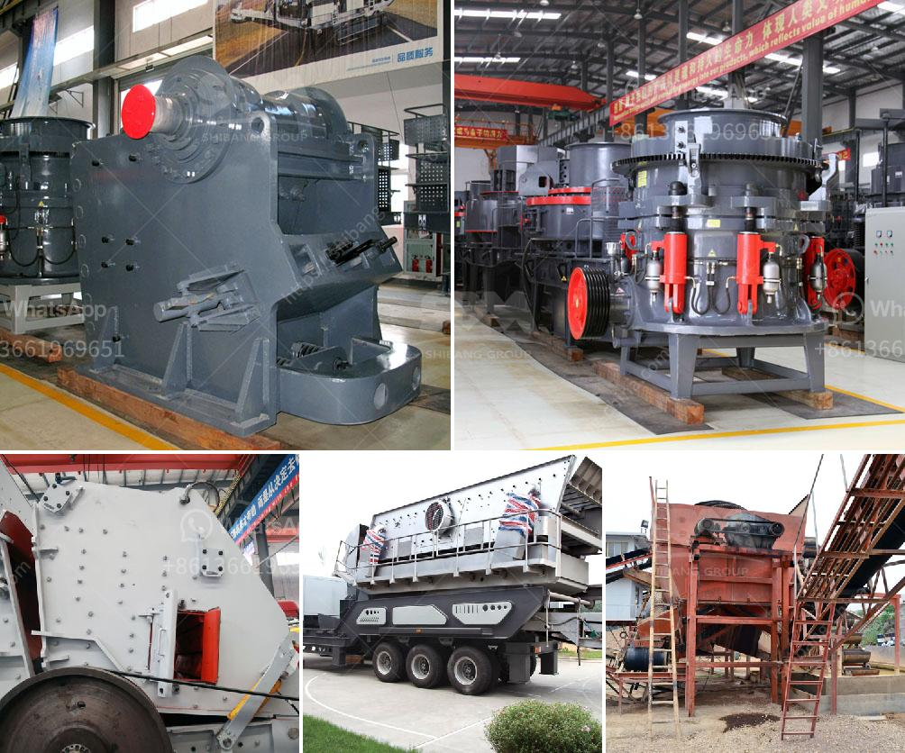

<h3>cara kerja mesin pemecah batu stone crusher</h3>
Mesin Pemecah Batu atau Stone Crusher merupakan salah satu mesin yang dirancang untuk menghancurkan batu menjadi ukuran lebih kecil. Mesin ini biasanya digunakan dalam industri pertambangan, konstruksi, metalurgi, dan banyak lagi. Mesin pemecah batu memiliki fungsi yang sangat penting dalam proses produksi, di mana batu-batu besar harus dipecah menjadi ukuran yang lebih kecil agar dapat digunakan untuk berbagai keperluan.

Cara kerja mesin pemecah batu tidak terlalu rumit. Pada dasarnya, mesin ini bekerja dengan memecahkan batu menggunakan energi mekanik. Mesin pemecah batu terdiri dari beberapa komponen utama, seperti hopper, vibrating feeder, jaw crusher, conveyor, dan vibrating screen. Semua komponen ini bekerja secara terkoordinasi untuk menghancurkan batu menjadi ukuran yang lebih kecil.

Proses dimulai dengan memasukkan batu ke dalam hopper. Hopper bertindak sebagai wadah untuk menampung batu yang akan dipecahkan. Batu kemudian diberikan ke vibrating feeder melalui aliran berkelanjutan. Vibrating feeder memainkan peran penting dalam mengatur aliran batu ke dalam jaw crusher.

Selanjutnya, batu masuk ke dalam jaw crusher melalui opening atau celah yang ada di atasnya. Jaw crusher memiliki rahang yang dapat membuka dan menutup secara periodik, sehingga batu menjadi terjepit di antara rahang tersebut. Ketika rahang terbuka, batu ditekan oleh tekanan tinggi dari rahang dan menghasilkan gaya pemecah yang besar.

Setelah proses pemecahan di jaw crusher, batu yang sudah dipecahkan akan jatuh ke conveyor. Conveyor berfungsi untuk mengangkut batu keluar dari mesin pemecah batu. Batu akan terus bergerak dalam conveyor menuju vibrating screen. Vibrating screen digunakan untuk memisahkan batu yang telah dipecah menjadi beberapa ukuran yang berbeda. Batu dengan ukuran yang sesuai akan dikumpulkan dan dapat digunakan untuk keperluan tertentu.

Proses kerja mesin pemecah batu biasanya dilakukan secara kontinyu, di mana batu-batu yang lebih besar terus dimasukkan ke dalam hopper. Mesin ini dapat menghancurkan berbagai jenis batu, seperti batu kapur, granit, batu kali, dan sebagainya. Ukuran hasil pecahan batu dapat disesuaikan dengan mengatur posisi celah pada jaw crusher.

Cara kerja mesin pemecah batu sangat efisien dan menghasilkan produk yang berkualitas. Mesin ini banyak dipakai dalam industri konstruksi, seperti pembangunan jalan, bangunan, jembatan, dan lainnya. Selain itu, mesin ini juga digunakan dalam industri pertambangan untuk menghancurkan batu bijih menjadi ukuran yang lebih kecil agar dapat diekstraksi dengan lebih mudah.

Dalam industri pertambangan, mesin pemecah batu sering digunakan bersama dengan mesin pengumpan, crusher sekunder, dan conveyor tambahan untuk membentuk lini produksi yang efisien dan produktif. Mesin ini juga memiliki fitur keamanan yang baik, seperti proteksi kelebihan beban dan sensor yang menghentikan operasi jika terjadi gangguan.

Dalam kesimpulan, mesin pemecah batu atau stone crusher dirancang untuk menghancurkan batu menjadi ukuran yang lebih kecil. Mesin ini bekerja dengan memecahkan batu menggunakan energi mekanik, seperti tekanan rahang pada jaw crusher. Mesin pemecah batu sangat penting dalam industri pertambangan, konstruksi, dan lainnya, dan telah menjadi alat yang tidak dapat diabaikan dalam proses produksi.
<h3>Contact us</h3><ul><li><strong>Whatsapp:&nbsp;<a href="https://wa.me/8613661969651">+8613661969651</a></strong></li><li><a href="https://swt.shibang-china.com/?git&amp;zhl&amp;cara kerja mesin pemecah batu stone crusher"><strong>Online Service(chat now)</strong></a></li></ul><h3>Related</h3><ul><li><a href='cone crusher size.md'>cone crusher size</a></li><li><a href='barite powder processing plant process flow diagram.md'>barite powder processing plant process flow diagram</a></li><li><a href='sand making machine saudi.md'>sand making machine saudi</a></li><li><a href='brazil best crusher manufacturing companies.md'>brazil best crusher manufacturing companies</a></li><li><a href='ball mill grinding.md'>ball mill grinding</a></li></ul>