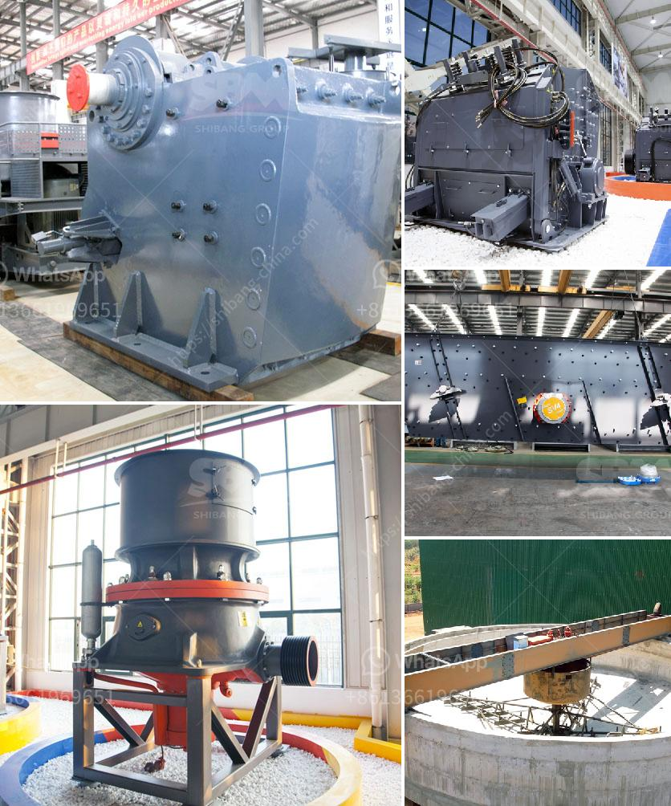

<h3>cara mengelola debu crucher batu bara</h3>
Batu bara merupakan salah satu sumber energi yang penting di dunia, digunakan dalam berbagai sektor industri, seperti pembangkit listrik, metalurgi, dan manufaktur. Namun, pengolahan batu bara tidak hanya melibatkan proses ekstraksi, tetapi juga menghasilkan banyak debu. Debu batu bara dapat mencemari lingkungan dan merugikan kesehatan manusia jika tidak dikelola dengan baik. Oleh karena itu, penting untuk menjaga dan mengelola debu crusher batu bara dengan tepat.

Pertama-tama, perusahaan pertambangan atau industri yang terlibat dalam pengolahan batu bara harus memahami sifat debu tersebut. Debu batu bara terdiri dari batu bara hancur, partikel kecil, dan serbuk yang dihasilkan selama proses penghancuran batu bara menggunakan crusher. Debu ini mengandung partikel-partikel berbahaya seperti sulfur, arsenik, merkuri, dan logam berat lainnya yang dapat merusak lingkungan dan kesehatan manusia.

Salah satu metode yang efektif untuk mengelola debu crusher batu bara adalah instalasi sistem pengendalian debu yang memadai. Sistem ini biasanya terdiri dari penggunaan penyemprotan air atau sistem kolektor debu. Penyemprotan air dapat digunakan untuk mengendalikan debu yang dihasilkan saat proses penghancuran berlangsung. Air akan menjerat debu dan menjaga partikel-partikel debu tetap terjaga agar tidak tersebar ke udara.

Selain itu, penggunaan sistem kolektor debu sangat penting dalam mengelola debu crusher batu bara. Sistem ini mampu menangkap partikel-partikel debu yang dihasilkan dan mencegahnya terlepas ke udara. Beberapa jenis sistem kolektor debu yang umum digunakan adalah kantong filter dan elektrostatik. Kantong filter terdiri dari serangkaian kantong filter yang mampu menangkap partikel debu dengan efisien. Sementara itu, sistem elektrostatik menggunakan medan listrik untuk menarik dan menjerat partikel debu.

Selain mengelola debu crusher batu bara selama proses penghancuran, perusahaan juga harus memikirkan langkah-langkah pengelolaan debu setelahnya. Debu yang terkumpul pada penyemprotan air atau sistem kolektor debu perlu dikelola dengan tepat. Debu batu bara dapat digunakan kembali dalam beberapa aplikasi industri seperti pembuatan bata atau industri semen. Jadi, pemanfaatan kembali debu sebagai bahan baku adalah langkah yang bijaksana untuk mengurangi dampak lingkungan.

Selain itu, penyimpanan dan pembuangan debu batu bara harus dilakukan dengan benar. Debu yang tertampung harus dibuang di tempat penampungan yang aman dan terkontrol untuk menghindari pencemaran lingkungan. Idealnya, perusahaan harus memiliki sistem pemadaman debu yang efektif untuk mencegah pencemaran udara yang lebih lanjut.

Kesimpulannya, pengelolaan debu crusher batu bara merupakan hal yang sangat penting dalam industri pertambangan dan pembangkit listrik. Debu dapat mencemari lingkungan dan membahayakan kesehatan manusia jika tidak dikelola dengan baik. Menerapkan sistem pengendalian debu yang efektif, seperti penyemprotan air dan sistem kolektor debu, adalah langkah awal yang penting. Selain itu, penggunaan kembali debu dan pembuangan debu yang benar juga harus dipertimbangkan dalam upaya mengurangi dampak lingkungan. Dengan demikian, perusahaan dapat berkontribusi untuk menjaga kelestarian lingkungan dan kesehatan manusia.
<h3>Contact us</h3><ul><li><strong>Whatsapp:&nbsp;<a href="https://wa.me/8613661969651">+8613661969651</a></strong></li><li><a href="https://swt.shibang-china.com/?git&amp;zhl&amp;cara mengelola debu crucher batu bara"><strong>Online Service(chat now)</strong></a></li></ul><h3>Related</h3><ul><li><a href='marble mining equipment manufacturers.md'>marble mining equipment manufacturers</a></li><li><a href='steel slag recycling plant.md'>steel slag recycling plant</a></li><li><a href='list of machineries for marble processing plants.md'>list of machineries for marble processing plants</a></li><li><a href='granite processing plant.md'>granite processing plant</a></li><li><a href='tonne stone crusher price for hire in cardiff.md'>tonne stone crusher price for hire in cardiff</a></li></ul>