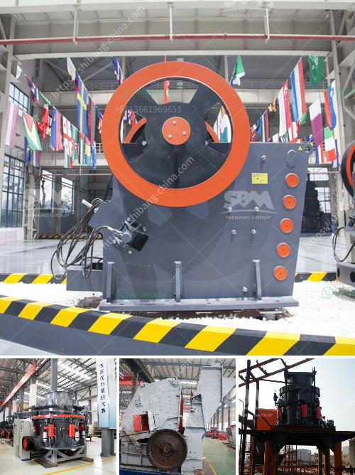

<h3>carbon black grinding</h3>
Carbon black is a fine black powder manufactured through the incomplete combustion of petroleum products like coal tar, ethylene cracking tar, and other sources. It is one of the most widely used materials in various industrial applications due to its excellent properties.

Grinding carbon black into a fine powder is vital in various manufacturing industries, such as rubber, plastics, paints, and coatings. The process of carbon black grinding involves reducing carbon black materials into smaller and more manageable particles to improve its dispersion qualities, color intensity, and quality.

There are several methods available for grinding carbon black, depending on the desired particle size and the equipment used. One common method involves the use of a ball mill, a type of grinding machine that uses steel or ceramic balls to grind materials into fine particles. In this process, carbon black materials are fed into the mill and are crushed and ground by the rotating balls until they reach the desired fineness.

Another method commonly used for carbon black grinding is a jet mill. Jet mills use high-pressure air or gas to grind particles. The carbon black materials are fed into the mill, and as the particles collide against each other under high pressure, they are reduced into finer particles.

Grinding carbon black offers several benefits to manufacturing industries. Firstly, it enhances the dispersion of carbon black, allowing it to be evenly distributed throughout the product. This improves the color intensity and overall appearance of the final product.

Additionally, grinding carbon black can increase the surface area of the material, improving its reactivity and making it more suitable for various applications. The increased surface area allows for better interaction between carbon black and other materials, enhancing their properties, such as increased strength and resilience in rubber compounds.

In conclusion, the process of carbon black grinding plays a crucial role in manufacturing industries due to its ability to improve dispersion, color intensity, and reactivity of carbon black materials. Whether using a ball mill or a jet mill, grinding carbon black allows for the customization of the final product's properties and contributes to its overall quality.
<h3>Contact us</h3><ul><li><strong>Whatsapp:&nbsp;<a href="https://wa.me/8613661969651">+8613661969651</a></strong></li><li><a href="https://swt.shibang-china.com/?git&amp;zhl&amp;carbon black grinding"><strong>Online Service(chat now)</strong></a></li></ul><h3>Related</h3><ul><li><a href='250tph grinding equipment price.md'>250tph grinding equipment price</a></li><li><a href='limestone process plant.md'>limestone process plant</a></li><li><a href='roll mill manufacturere in mumbai.md'>roll mill manufacturere in mumbai</a></li><li><a href='used cone crushers zambia.md'>used cone crushers zambia</a></li><li><a href='stone grinding plant.md'>stone grinding plant</a></li></ul>