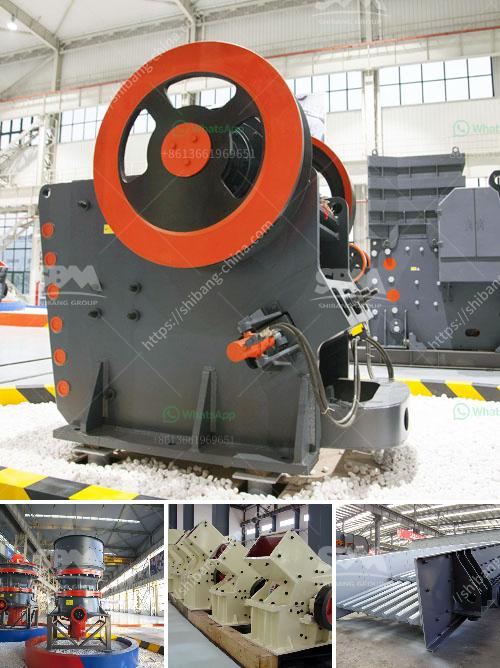

<h3>carbonate grinding plant feasibility study</h3>
The demand for calcium carbonate has been increasing over the past few years, mainly due to its use in various industries such as paper, plastics, paints, coatings, and construction. Calcium carbonate grinding is a vital process in the production of these industries. With the growing demand for calcium carbonate, setting up a grinding plant is a feasible project. However, thorough feasibility analysis needs to be conducted before making a final decision.

A feasibility study aims to evaluate the prospective project's technical, economic, and financial viability. Let's look at the key factors to consider in conducting a feasibility study for a carbonate grinding plant.

1. Market Analysis: It is crucial to understand the market demand for calcium carbonate and the potential competition in the industry. Analyze the current market size, growth rate, and trends to assess the feasibility of the project. Identify the target customers and their requirements to ensure there is sufficient demand.

2. Raw Materials: Calcium carbonate can be obtained from various sources such as limestone, marble, chalk, or shells. Evaluate the availability, quality, and cost of raw materials in the proposed project location. It is essential to secure a stable and cost-effective supply of raw materials to ensure the continuous operation of the grinding plant.

3. Technology and Equipment: Assess the available grinding technologies and select the most suitable one based on the project requirements. Consider the equipment and machinery needed for the grinding process, such as crushers, mills, classifiers, and bagging systems. Evaluate the costs associated with the purchase, installation, and maintenance of these machines.

4. Location: Determine the ideal location for the grinding plant. Consider factors such as proximity to raw material sources, transportation infrastructure, and access to utilities like water and electricity. Also, analyze the availability of skilled labor in the chosen location and assess potential labor costs.

5. Environmental Impact: Evaluate the potential environmental impacts of the grinding plant. Assess the emissions and waste generated during the grinding process and ensure compliance with environmental regulations. Implement suitable measures to mitigate any adverse effects, such as dust control systems and wastewater treatment.

6. Financial Analysis: Conduct a detailed financial analysis to assess the project's economic feasibility. Calculate the initial investment required, including land, construction, machinery, and working capital. Estimate the operating costs, including raw material procurement, labor, utilities, and maintenance. Determine the projected revenue based on market demand and pricing trends. Finally, evaluate the profitability of the project through financial indicators such as net present value (NPV), internal rate of return (IRR), and payback period.

7. Risk Assessment: Identify the potential risks and challenges associated with the project. These could include market volatility, regulatory hurdles, supply chain disruptions, or technological limitations. Develop contingency plans and risk mitigation strategies to minimize the impact of these risks.

Completing a comprehensive feasibility study will provide valuable insights into the viability of a carbonate grinding plant. It will help assess the technical and economic feasibility, identify potential challenges, and guide decision-making regarding project implementation. By conducting a thorough analysis, investors can make informed choices and maximize the chances of a successful venture in the calcium carbonate grinding industry.
<h3>Contact us</h3><ul><li><strong>Whatsapp:&nbsp;<a href="https://wa.me/8613661969651">+8613661969651</a></strong></li><li><a href="https://swt.shibang-china.com/?git&amp;zhl&amp;carbonate grinding plant feasibility study"><strong>Online Service(chat now)</strong></a></li></ul><h3>Related</h3><ul><li><a href='crushers and screeners for hire in usa.md'>crushers and screeners for hire in usa</a></li><li><a href='250 mesh hammer mill.md'>250 mesh hammer mill</a></li><li><a href='how to make ganpati with marble powdee.md'>how to make ganpati with marble powdee</a></li><li><a href='used lab scale crusher price.md'>used lab scale crusher price</a></li><li><a href='ball mills brands.md'>ball mills brands</a></li></ul>