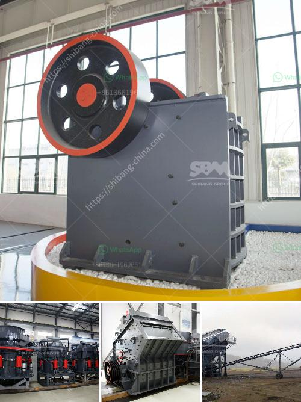

<h3>cement clinker crusher project india</h3>
Cement is a binder used in construction that sets, hardens, and adheres to other materials. It is an essential component of concrete and plays a vital role in the development of infrastructure and buildings. The production of cement involves several stages, including the mining and crushing of raw materials, grinding and blending clinker, and its final packaging. One crucial machine used in this process is the clinker crusher.

A cement clinker crusher is a piece of equipment that grinds clinker into fine powder, which is an essential ingredient in the production of cement. It facilitates the mixing of cement with other additives and prevents agglomeration that may affect the performance of the final product. Cement clinker crushers are widely used in cement manufacturing industries, including the mining and crushing stage.

In India, grinding and blending of clinker and other raw materials have become increasingly important in the cement industry. With the country's rapid infrastructure growth, there is a huge demand for cement, and even more so for clinker. To meet this demand, India is currently focusing on the implementation of cement clinker crusher projects.

One such project is the clinker crusher plant in India. A key component of any cement plant, the clinker crusher is the first point of contact for the comminution of clinker in the cement production process. The clinker crusher section has a large kiln to ensure efficient grinding of clinker. Modern clinker production is increasingly high-capacity, while traditional methods are often inefficient. This project aims to modernize the clinker crusher plant to improve productivity and reduce energy consumption.

To achieve these goals, the project will focus on upgrading key components of the clinker crusher plant. This includes the installation of a new clinker crusher, which can handle higher capacity and improve the overall efficiency of clinker grinding. Additionally, the project will introduce advanced automation and monitoring systems to ensure smooth operation and better control over the clinker crusher process.

The cement clinker crusher project in India will bring several benefits to the cement industry and the country as a whole. Firstly, it will help meet the ever-increasing demand for cement and clinker, ensuring a steady supply to support infrastructure development. Secondly, the project will lead to more efficient and sustainable production practices, reducing energy consumption and environmental impact.

Moreover, the project's focus on modernizing the clinker crusher plant will boost employment opportunities in the construction and manufacturing sectors. As the cement industry expands, it will create jobs for both skilled and unskilled workers, stimulating economic growth and development.

In conclusion, the cement clinker crusher project in India is a significant initiative that aims to upgrade the clinker crusher plant, improve productivity, and reduce energy consumption. This project will contribute to meeting the increasing demand for cement and clinker, while also creating employment opportunities and promoting sustainable development in the country. With the successful implementation of the project, India's cement industry will be better equipped to support the infrastructure growth and contribute to the overall economic progress of the nation.
<h3>Contact us</h3><ul><li><strong>Whatsapp:&nbsp;<a href="https://wa.me/8613661969651">+8613661969651</a></strong></li><li><a href="https://swt.shibang-china.com/?git&amp;zhl&amp;cement clinker crusher project india"><strong>Online Service(chat now)</strong></a></li></ul><h3>Related</h3><ul><li><a href='hammer mill 50 hr.md'>hammer mill 50 hr</a></li><li><a href='purity chura crushing machine.md'>purity chura crushing machine</a></li><li><a href='suplier jaw stone crusher nakayama in indonesia.md'>suplier jaw stone crusher nakayama in indonesia</a></li><li><a href='sand making machine saudi.md'>sand making machine saudi</a></li><li><a href='components of a ball mill.md'>components of a ball mill</a></li></ul>