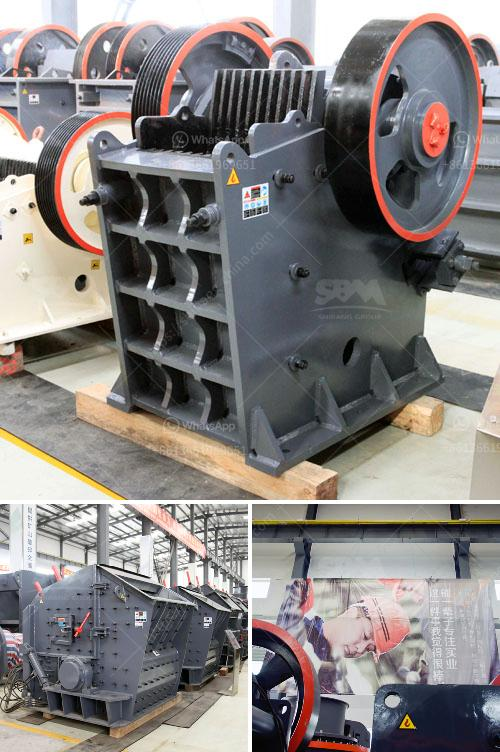

<h3>cement clinker plant</h3>
Cement clinker plants function as one of the crucial components in the construction industry. These plants are responsible for the production of clinker, a key ingredient of cement. Clinker is obtained by heating limestone, clay, and other materials at high temperatures, resulting in the formation of small, dark grey nodules. These nodules are then ground into a fine powder, which is mixed with gypsum to produce cement.

The process of manufacturing clinker involves various stages. First, the raw materials are collected and transported to the plant, where they undergo rigorous quality checks. Once the materials are approved, they are crushed into smaller pieces and mixed thoroughly to achieve a homogenous mixture. This mixture, known as raw meal, is then fed into the kiln for further processing.

The kiln plays a crucial role in the production of clinker. It is a large, cylindrical furnace where the raw meal is subjected to intense heat. The temperature inside the kiln can reach up to 1500 degrees Celsius, causing chemical reactions to occur. These reactions transform the raw materials into clinker, which is then cooled and ground into a powder.

Cement clinker plants are equipped with advanced technology and machinery to ensure an efficient production process. State-of-the-art control systems monitor and regulate various parameters such as temperature, pressure, and feed rate. This automation allows for precise control of the kiln operation, optimizing energy consumption and reducing environmental impact.

One of the major advantages of cement clinker plants is their ability to utilize a wide range of raw materials. Different types of limestone, clay, shale, and slag can be used as feedstock, depending on their availability and quality. This flexibility not only ensures a continuous supply of clinker but also reduces dependence on specific raw materials.

The production of clinker is a resource-intensive process, requiring considerable amounts of energy and water. However, cement clinker plants are constantly striving to minimize their environmental footprint. Energy-efficient kilns, waste heat recovery systems, and water recycling initiatives are some of the measures implemented to reduce resource consumption and minimize emissions.

The significance of cement clinker plants extends beyond their role in cement production. These plants also contribute to local economies by providing employment opportunities and supporting ancillary industries. From mining and transportation of raw materials to maintenance and operation of machinery, the clinker plant sector generates numerous jobs and fosters economic growth.

In conclusion, cement clinker plants form the backbone of the construction industry. Without these plants, the production of cement – a crucial building material – would not be possible. As technology continues to advance and environmental concerns persist, it is essential for clinker plants to embrace sustainable practices and work towards a greener future. By implementing innovative solutions and reducing their impact on the environment, cement clinker plants will play a pivotal role in shaping the sustainable development of the construction industry.
<h3>Contact us</h3><ul><li><strong>Whatsapp:&nbsp;<a href="https://wa.me/8613661969651">+8613661969651</a></strong></li><li><a href="https://swt.shibang-china.com/?git&amp;zhl&amp;cement clinker plant"><strong>Online Service(chat now)</strong></a></li></ul><h3>Related</h3><ul><li><a href='jaw crusher materials.md'>jaw crusher materials</a></li><li><a href='rock grinder crusher suppliers kenya.md'>rock grinder crusher suppliers kenya</a></li><li><a href='ball mills china.md'>ball mills china</a></li><li><a href='small profile format for crusher company.md'>small profile format for crusher company</a></li><li><a href='stone crusher machine for rent in kenya.md'>stone crusher machine for rent in kenya</a></li></ul>