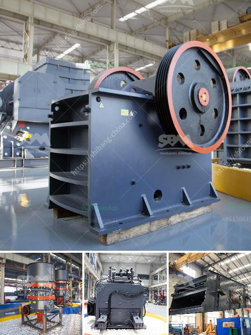

<h3>cement clinker processing plant</h3>
Cement is one of the most widely used construction materials in the world. Made primarily from limestone and clay, it is mixed with other materials such as sand, gravel, and water to create concrete. One of the key components of cement production is the clinker, a nodular material produced by heating limestone and clay at a high temperature.

Cement clinker processing plants are crucial in the cement production process, as they grind and blend raw materials to produce the desired quality and consistency of cement. The clinker processing plant includes a series of equipment such as crushers, conveyors, kilns, mills, and separators.

Crushers are used to break down the clinker into smaller pieces, while conveyors transport the crushed clinker to storage or grinding units. Kilns, the heart of the cement manufacturing process, are used to heat the raw materials to a temperature of around 1400°C, where they undergo chemical reactions to form clinker. Mills further grind the clinker into a fine powder, which is then mixed with gypsum to produce cement.

The cement clinker processing plant has a significant impact on the environment due to the energy-intensive nature of cement production. However, modern processing plants incorporate advanced technologies to minimize their environmental footprint. For instance, some plants use alternative fuels, such as biomass or waste materials, instead of traditional fossil fuels, reducing greenhouse gas emissions.

In summary, cement clinker processing plants play a crucial role in the production of high-quality cement. By grinding and blending raw materials, these plants ensure the consistency and durability of the final product. Efforts are made to minimize their environmental impact through the adoption of sustainable practices. As the demand for cement continues to rise worldwide, the importance of efficient clinker processing plants will only increase.
<h3>Contact us</h3><ul><li><strong>Whatsapp:&nbsp;<a href="https://wa.me/8613661969651">+8613661969651</a></strong></li><li><a href="https://swt.shibang-china.com/?git&amp;zhl&amp;cement clinker processing plant"><strong>Online Service(chat now)</strong></a></li></ul><h3>Related</h3><ul><li><a href='portable cedar rapids rock crusher.md'>portable cedar rapids rock crusher</a></li><li><a href='chrome washing machine plant eluvial.md'>chrome washing machine plant eluvial</a></li><li><a href='mobile stone crusher in germany.md'>mobile stone crusher in germany</a></li><li><a href='stone crusher hyderabad.md'>stone crusher hyderabad</a></li><li><a href='stone crusher machine china.md'>stone crusher machine china</a></li></ul>