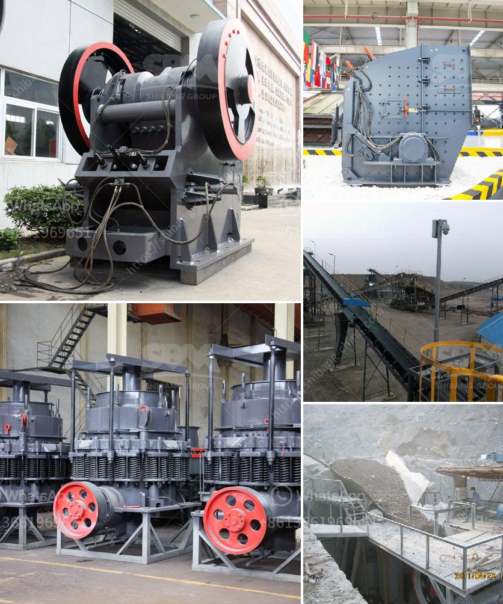

<h3>cement factory plant cost</h3>
The cement industry is a crucial part of the construction sector. As cement is an essential building material, the demand for cement is expected to increase substantially in the coming years. To meet this mounting demand, cement companies are constantly expanding their production capabilities. One of the key considerations for these companies is the cost of setting up a cement factory plant.

Setting up a cement factory plant is not an easy task. It requires extensive planning, proper execution, and significant financial investment. The cost of a cement factory plant depends on various factors, such as the production capacity, location, size, and scale of operations. These factors need to be carefully analyzed to determine an accurate estimation of the cost.

The production capacity of a cement factory plant is often measured in tons per day. Larger plants can have a production capacity of up to thousands of tons per day, while smaller plants can have a capacity of a few hundred tons per day. The cost of setting up a cement factory plant increases with the production capacity due to the requirement of more machinery, raw materials, and labor.

The location of the plant is another critical factor that affects the cost. Proximity to raw material sources and target markets plays a significant role in determining the cost. If the plant is located near limestone quarries, which are the primary source of raw materials for cement production, the cost of transporting raw materials to the plant decreases significantly. Similarly, being close to the target market reduces transportation expenses and ensures timely delivery.

The size and scale of operations also impact the cost of setting up a cement factory plant. A larger plant requires more land, additional infrastructure, and higher operational costs. Moreover, larger plants tend to have more specialized machinery and equipment, which increases the overall cost. Smaller plants, on the other hand, may have higher unit costs due to the absence of economies of scale.

The cost estimation of setting up a cement factory plant can be challenging due to numerous uncertainties associated with the construction industry. Factors such as inflation, currency exchange rates, and changes in regulations can significantly impact the cost. Therefore, it is essential to conduct a comprehensive feasibility study and cost analysis before initiating the project.

Despite the high initial investment, setting up a cement factory plant can prove to be a lucrative venture. As the demand for cement continues to grow, investing in the cement industry can generate substantial returns. Cement factory plants are not only profitable but also provide employment opportunities and contribute to the overall economic development of the region.

In conclusion, the cost of setting up a cement factory plant depends on several factors, including production capacity, location, size, and scale of operations. Conducting a detailed analysis and feasibility study is crucial to accurately estimate the cost. Although the initial investment may be significant, investing in a cement factory plant can yield substantial returns in the long run.
<h3>Contact us</h3><ul><li><strong>Whatsapp:&nbsp;<a href="https://wa.me/8613661969651">+8613661969651</a></strong></li><li><a href="https://swt.shibang-china.com/?git&amp;zhl&amp;cement factory plant cost"><strong>Online Service(chat now)</strong></a></li></ul><h3>Related</h3><ul><li><a href='mobile roller crushers in south africa.md'>mobile roller crushers in south africa</a></li><li><a href='how much is a hammer mill.md'>how much is a hammer mill</a></li><li><a href='enquiry about sand making machine.md'>enquiry about sand making machine</a></li><li><a href='distributor stone crusher machine indonesia.md'>distributor stone crusher machine indonesia</a></li><li><a href='ball mill particle size in micrometets.md'>ball mill particle size in micrometets</a></li></ul>