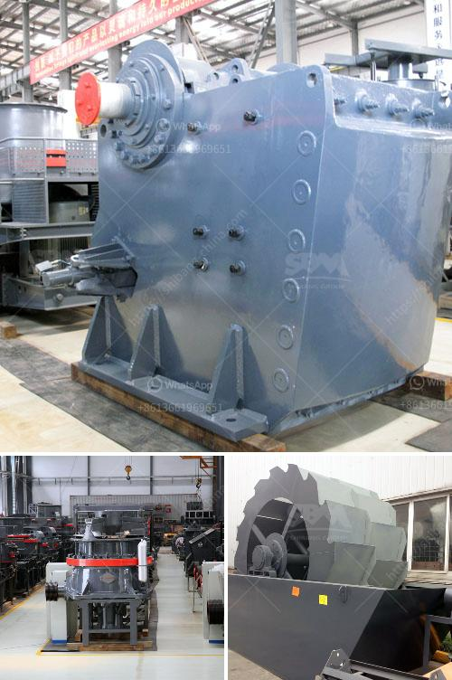

<h3>cement machinery suppliers grinding unit</h3>
Cement is a crucial component in the construction industry, and the demand for it continues to grow rapidly. To meet this demand, cement manufacturers require efficient and reliable machinery to produce high-quality cement. Cement grinding units play a vital role in this process, as they grind the clinker particles into a fine powder, making it ready for the next stages of the cement production process.

Cement grinding units are responsible for comminuting the raw materials, clinker, gypsum, and other additives to produce the desired quality of cement. These machines are typically designed to grind clinker to a specific fineness, ensuring that it meets the required specifications for strength, durability, and setting time.

To ensure the efficient operation of a cement grinding unit, it is crucial to select the right machinery and equipment from reputable suppliers. There are several factors that cement manufacturers should consider when choosing a grinding unit supplier.

Firstly, the supplier's track record and reputation in the industry are crucial. Cement manufacturers should opt for suppliers with extensive experience in designing and manufacturing cement grinding units. Suppliers with a proven track record will understand the challenges and requirements of cement production and provide reliable machinery that meets industry standards.

Secondly, the supplier's technical expertise and support are essential. Cement grinding units involve complex machinery and equipment, and it is crucial to have experts available for installation, maintenance, and troubleshooting. Suppliers should provide comprehensive technical support to ensure the smooth operation of the grinding unit throughout its lifespan.

Thirdly, the supplier's range of grinding unit options should align with the manufacturer's specific needs. Different cement manufacturers may require grinding units of varying capacities, output quality, and energy efficiency. Therefore, the supplier should offer a wide range of options to cater to these diverse requirements, ensuring that manufacturers can find the right grinding unit that suits their production needs.

Additionally, the supplier's commitment to innovation and sustainability should be considered. The cement industry is increasingly focused on reducing its environmental impact and improving energy efficiency. Suppliers that invest in research and development to develop innovative and sustainable grinding unit technologies enable manufacturers to meet these evolving challenges.

Lastly, it is crucial to consider the supplier's delivery and after-sales service capabilities. Timely delivery of machinery and spare parts is essential to prevent any disruptions in the manufacturing process. Additionally, the supplier should provide prompt and efficient after-sales service to address any potential issues or maintenance requirements.

In conclusion, cement machinery suppliers play a crucial role in the success of cement manufacturing. Choosing the right grinding unit supplier is essential to ensure the efficient and reliable production of high-quality cement. By considering factors such as track record, technical expertise, range of options, innovation, and after-sales service, cement manufacturers can select a supplier that meets their specific requirements and contributes to the growth and sustainability of the industry.
<h3>Contact us</h3><ul><li><strong>Whatsapp:&nbsp;<a href="https://wa.me/8613661969651">+8613661969651</a></strong></li><li><a href="https://swt.shibang-china.com/?git&amp;zhl&amp;cement machinery suppliers grinding unit"><strong>Online Service(chat now)</strong></a></li></ul><h3>Related</h3><ul><li><a href='crusher machine factories in coimbatore.md'>crusher machine factories in coimbatore</a></li><li><a href='ball mill price list philippines.md'>ball mill price list philippines</a></li><li><a href='price list stone crusher machine sri lanka.md'>price list stone crusher machine sri lanka</a></li><li><a href='indonesia crushers of how much price.md'>indonesia crushers of how much price</a></li><li><a href='ball mill machine.md'>ball mill machine</a></li></ul>