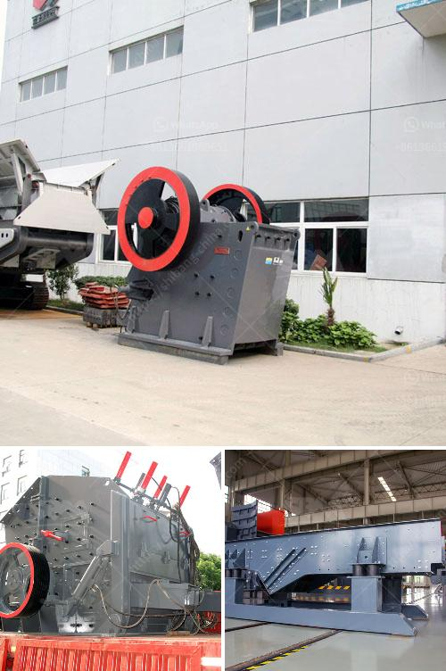

<h3>cement mill liner manufacturers in india</h3>
Cement mill liners play a crucial role in the efficiency and safety of the grinding process of cement plants. These liners are used to protect the inner shell of the mill from abrasion and impact. Additionally, they also enhance the grinding performance by ensuring a uniform and steady flow of material through the mill.

In India, there are several cement mill liner manufacturers with a reputation for delivering reliable and high-quality products. In order to meet the diverse needs of the cement industry, these manufacturers offer a range of products for various applications. Many cement mill liners manufacturers in India have established a strong foothold in the market due to their exceptional products and customer oriented approach.

Undoubtedly, this is a lucrative business segment. Cement plays a significant role in the construction industry, and hence, the demand for cement mill liners is high. In forthcoming years, the manufacturers are focusing on development of advanced products. Furthermore, the manufacturers are proactively participating in partnerships and acquisitions to strengthen their market presence.

- Bradken India Private Limited: Based in Kolkata, Bradken is a leading manufacturer of high-quality cement mill liners.

- Bradken’s global manufacturing and foundry facilities offer advanced casting technologies and engineering capabilities to deliver innovative mill liners and other related products.

- Youcement Private Limited: Established in 2015, Youcement is a renowned cement mill liners manufacturer in India.

- The company offers a wide range of products such as mill liners, wear plates, blow bars, grizzly bars, and more.

- Youcement’s products are known for their high-quality and durability, making them ideal for the cement industry.

- ArcelorMittal: With a presence in over 60 countries, including India, ArcelorMittal is a global leader in steel production and mining.

- The company offers a range of products for the cement industry, including mill liners, grinding media, and more.

- ArcelorMittal’s cement mill liners are manufactured using advanced casting techniques that ensure optimum durability and reliability.

These are just a few examples of the cement mill liner manufacturers in India. They strive to offer the best products and services to their customers and contribute to the growth of the cement industry. With the increasing demand for cement and the growing number of cement plants in India, the market for mill liners is expected to expand in the coming years.
<h3>Contact us</h3><ul><li><strong>Whatsapp:&nbsp;<a href="https://wa.me/8613661969651">+8613661969651</a></strong></li><li><a href="https://swt.shibang-china.com/?git&amp;zhl&amp;cement mill liner manufacturers in india"><strong>Online Service(chat now)</strong></a></li></ul><h3>Related</h3><ul><li><a href='mineral pulverising mills in south africa.md'>mineral pulverising mills in south africa</a></li><li><a href='coal crusher design calculation.md'>coal crusher design calculation</a></li><li><a href='quarry stone crusher machine.md'>quarry stone crusher machine</a></li><li><a href='stone crusher machine manufacturer in ethiopia.md'>stone crusher machine manufacturer in ethiopia</a></li><li><a href='size reduction equipment ball mill in details.md'>size reduction equipment ball mill in details</a></li></ul>