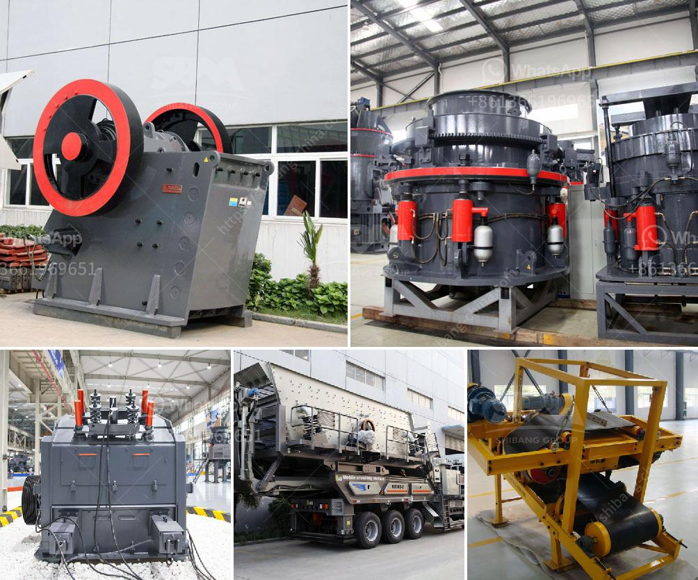

<h3>cement mill plant design drawings</h3>
Cement is an essential component of infrastructure development. It is used to build roads, bridges, buildings, and various other structures. The process of producing cement involves several stages, one of which is the grinding of clinker into fine powder. This is done in a cement mill plant.

The design of a cement mill plant is not just limited to the grinding process alone but also includes other accessories such as a conveyor system, bucket elevators, weighing scales, and dust collectors. These accessories all work together to ensure a smooth and efficient grinding process. Therefore, proper design and layout of the cement mill plant are crucial for successful operation.

The first step in designing a cement mill plant is to select the appropriate equipment. The key equipment required to grind clinker into fine powder is a ball mill, which is cylindrical in shape and rotates around its horizontal axis. The grinding media in the ball mill crushes and grinds the clinker, which is then discharged through a perforated screen. The size of the balls in the mill and the speed at which it rotates determine the fineness of the resulting cement powder.

Other important equipment in a cement mill plant includes a conveyor system, which transports the clinker from the storage silo to the ball mill. The conveyor system should be designed to minimize the risk of spillage and blockages. It should also have the capacity to handle the required amount of clinker and be easily maintainable.

Bucket elevators are used to transport the cement powder from the ball mill to the storage silo. These elevators are designed to transport bulk materials vertically, and their capacity should match the throughput of the ball mill. It is important to ensure that the bucket elevators have proper sealing to avoid dust leakage.

Dust collectors are an essential part of a cement mill plant as they prevent the escape of dust into the atmosphere. The high temperature and fine particles produced during the grinding process can be hazardous to the environment and human health. Therefore, the design of the dust collectors should include efficient filters and proper exhaust systems to capture and remove the dust particles.

The overall layout of a cement mill plant should be designed to optimize space utilization and workflow efficiency. The equipment should be arranged in a logical sequence, allowing easy access for maintenance and operation. Adequate space should be available for material storage, as well as for the movement of trucks and other vehicles.

In conclusion, the design of a cement mill plant plays a crucial role in ensuring a smooth and efficient grinding process. Proper selection and layout of equipment, such as ball mills, conveyor systems, bucket elevators, and dust collectors, are essential for successful operation. The design should aim to optimize space utilization, minimize the risk of spillage, and provide easy access for maintenance. With proper design and attention to detail, a cement mill plant can contribute to the production of high-quality cement for various infrastructure projects.
<h3>Contact us</h3><ul><li><strong>Whatsapp:&nbsp;<a href="https://wa.me/8613661969651">+8613661969651</a></strong></li><li><a href="https://swt.shibang-china.com/?git&amp;zhl&amp;cement mill plant design drawings"><strong>Online Service(chat now)</strong></a></li></ul><h3>Related</h3><ul><li><a href='hammer mill how it works.md'>hammer mill how it works</a></li><li><a href='plant grinder mill price.md'>plant grinder mill price</a></li><li><a href='jaw crushers manufacturers europe.md'>jaw crushers manufacturers europe</a></li><li><a href='stone crushers looking for partners.md'>stone crushers looking for partners</a></li><li><a href='mining crusher machines in selling in kenya.md'>mining crusher machines in selling in kenya</a></li></ul>