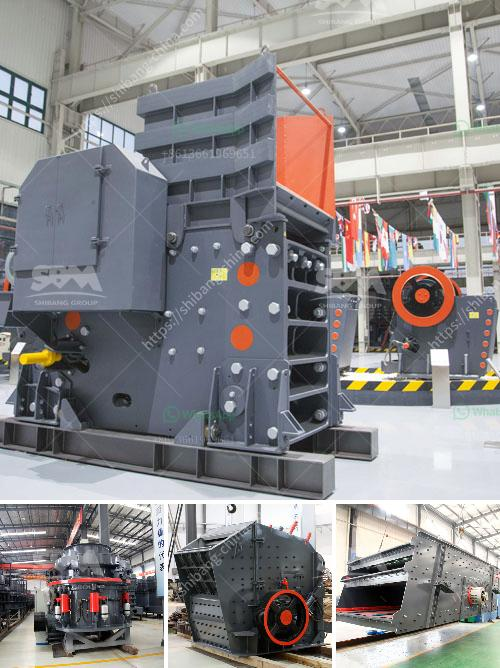

<h3>cement plant business plan</h3>
A cement plant business plan is a written document that outlines the objectives and strategies for establishing and operating a cement manufacturing facility. It includes information about the market analysis, manufacturing process, production costs, marketing, and financial analysis.

A cement plant is a lucrative business opportunity in the construction sector. With the increasing demand for cement, the industry is expected to grow significantly in the coming years. Therefore, starting a cement manufacturing plant can be a profitable venture for entrepreneurs who want to make a mark in the manufacturing sector.

The first step in creating a cement plant business plan is conducting thorough market research. This involves studying the local construction industry, understanding the demand for cement, and analyzing the competition. By identifying the target market and assessing the demand, entrepreneurs can determine the size and scale of the plant.

Once the market analysis is complete, it is important to define the manufacturing process. This includes deciding on the type of cement to be produced, such as Portland cement or blended cement. The entrepreneurs should also consider the source of raw materials, such as limestone, clay, or shale. A detailed description of the production process, including the equipment required and the energy consumption, should be provided in the business plan.

The next step is to determine the production costs. This involves estimating the capital investment required to set up the plant, including the cost of land, buildings, machinery, and vehicles. It is also important to consider the operating costs, such as labor, energy, and maintenance. By accurately calculating the production costs, entrepreneurs can assess the profitability of the business and determine the selling price of the cement.

In addition to production, a cement plant business plan should outline the marketing strategies. This includes identifying the target customers, such as contractors, builders, and infrastructure developers, and developing a comprehensive marketing plan to reach them. The plan should include advertising and promotional activities, as well as pricing strategies and distribution channels.

Finally, a cement plant business plan should include a financial analysis. This involves preparing projected income statements, cash flow statements, and balance sheets for the first few years of operation. It is important to assess the profitability and viability of the business, and to determine the funding requirements.

In conclusion, a cement plant business plan is an essential tool for entrepreneurs who want to start a cement manufacturing facility. It provides a roadmap for establishing and operating the plant, and helps entrepreneurs assess the market opportunity, understand the production process, determine costs, develop marketing strategies, and evaluate the financial viability of the business. With proper planning and execution, a cement plant can become a successful and profitable venture in the construction industry.
<h3>Contact us</h3><ul><li><strong>Whatsapp:&nbsp;<a href="https://wa.me/8613661969651">+8613661969651</a></strong></li><li><a href="https://swt.shibang-china.com/?git&amp;zhl&amp;cement plant business plan"><strong>Online Service(chat now)</strong></a></li></ul><h3>Related</h3><ul><li><a href='looking for small coal processing equipment.md'>looking for small coal processing equipment</a></li><li><a href='cost of setting up a cement plant in usa.md'>cost of setting up a cement plant in usa</a></li><li><a href='chrome washing machine plant eluvial.md'>chrome washing machine plant eluvial</a></li><li><a href='coal screening plant south africa.md'>coal screening plant south africa</a></li><li><a href='crusher machine sri lanka.md'>crusher machine sri lanka</a></li></ul>