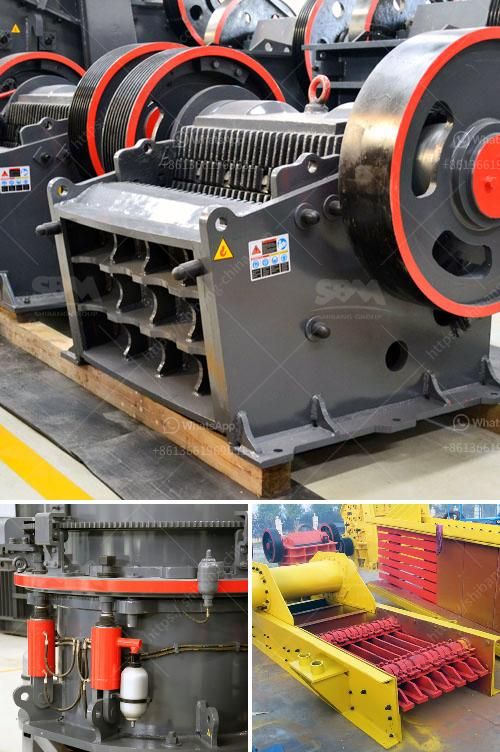

<h3>cement plant cost estimation in india pdf</h3>
Cement is an essential component for the construction industry, and its demand is rapidly growing in India. With the government's focus on infrastructure development, the cement industry is expected to witness substantial growth in the coming years. However, setting up a cement manufacturing plant requires careful planning and cost estimation.

The cost estimation of a cement plant is a complex process that involves several factors. It can vary significantly depending on the size, location, and the type of technology used. A small-scale cement plant with a capacity of 50-100 tons per day can cost around Rs. 1.5-2 crores, while a medium-sized plant with a capacity of 200-500 tons per day can cost approximately Rs. 5-10 crores. Larger plants with capacities exceeding 500 tons per day can cost over Rs. 20 crores.

Several cost components contribute to the overall estimation. These include land and site development, machinery and equipment, raw materials and utilities, labor, transportation, legal and administrative expenses, and contingencies. Additionally, the cost of environmental compliance measures and feasibility studies also need to be considered.

It is essential to conduct a detailed feasibility study and site analysis to estimate the accurate cost of setting up a cement plant. This involves obtaining quotations from equipment suppliers, conducting market research to determine the demand and supply dynamics, and assessing the availability of raw materials and utilities in the area.

The cost estimation process also involves assessing the financial viability of the project. This includes calculating the return on investment, payback period, and assessing the profitability of the plant in the long run. Additionally, it is crucial to consider the regulatory and legal requirements, environmental impact assessment, and obtaining necessary permits and approvals from local authorities.

India is the second-largest cement producer globally, and the industry is expected to witness significant growth in the coming years. However, setting up a cement plant requires careful planning and accurate cost estimation. It is recommended to engage experts in the field and conduct thorough research before making any investment decisions.
<h3>Contact us</h3><ul><li><strong>Whatsapp:&nbsp;<a href="https://wa.me/8613661969651">+8613661969651</a></strong></li><li><a href="https://swt.shibang-china.com/?git&amp;zhl&amp;cement plant cost estimation in india pdf"><strong>Online Service(chat now)</strong></a></li></ul><h3>Related</h3><ul><li><a href='grinding plant improvement.md'>grinding plant improvement</a></li><li><a href='raymond mill technical specification.md'>raymond mill technical specification</a></li><li><a href='crushing plant limestone.md'>crushing plant limestone</a></li><li><a href='industrial vibrating feeder.md'>industrial vibrating feeder</a></li><li><a href='cement factory plant cost.md'>cement factory plant cost</a></li></ul>