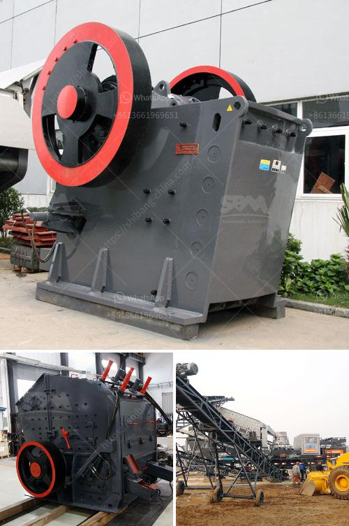

<h3>cement plant production line</h3>
Cement is a crucial building material in construction, playing a vital role in both residential and commercial projects. The production of cement involves a complex process, which requires a dedicated cement plant production line.

A cement plant production line consists of various stages, beginning with the extraction of limestone and clay from quarries. These materials are then crushed, blended, and heated at high temperatures to form clinker. The clinker is then ground into a fine powder, known as cement.

The production line can vary in size and capacity depending on the demands of the market. However, a typical cement plant production line usually consists of several key components. These include crushers, raw material mills, preheaters, rotary kilns, cement mills, and packing plants.

Crushers are used to break down the extracted raw materials into smaller pieces. Raw material mills grind the crushed materials into a fine powder, ensuring a consistent mixture. Preheaters use heat and air to pre-process the raw materials before they enter the rotary kiln.

The rotary kiln is the heart of the cement production process. It is a large, cylindrical furnace where the clinker is heated at extremely high temperatures, around 1400-1500 degrees Celsius. This process, known as calcination, results in the formation of clinker.

After the clinker exits the kiln, it passes through a series of cement mills, where it is ground into a fine powder. Finally, the cement is transported to the packing plant, where it is packaged in bags or loaded onto trucks for delivery to construction sites.

A cement plant production line with a capacity of 100-300 tons per day is considered a medium-sized plant. Such a production line can meet the demands of small to medium-sized construction projects in the local area. However, larger plants are also available, with capacities exceeding several thousand tons per day.

In conclusion, a cement plant production line is essential for the production of cement, a critical component in construction projects. Whether small or large, these production lines are designed to efficiently process raw materials into high-quality cement, ensuring a reliable supply in the market.
<h3>Contact us</h3><ul><li><strong>Whatsapp:&nbsp;<a href="https://wa.me/8613661969651">+8613661969651</a></strong></li><li><a href="https://swt.shibang-china.com/?git&amp;zhl&amp;cement plant production line"><strong>Online Service(chat now)</strong></a></li></ul><h3>Related</h3><ul><li><a href='china stone crusher pe 400 specs.md'>china stone crusher pe 400 specs</a></li><li><a href='quartz production process.md'>quartz production process</a></li><li><a href='stone crusher project report.md'>stone crusher project report</a></li><li><a href='aggregate grinding mill manufacturers in south philippines.md'>aggregate grinding mill manufacturers in south philippines</a></li><li><a href='quarry plant solutions.md'>quarry plant solutions</a></li></ul>