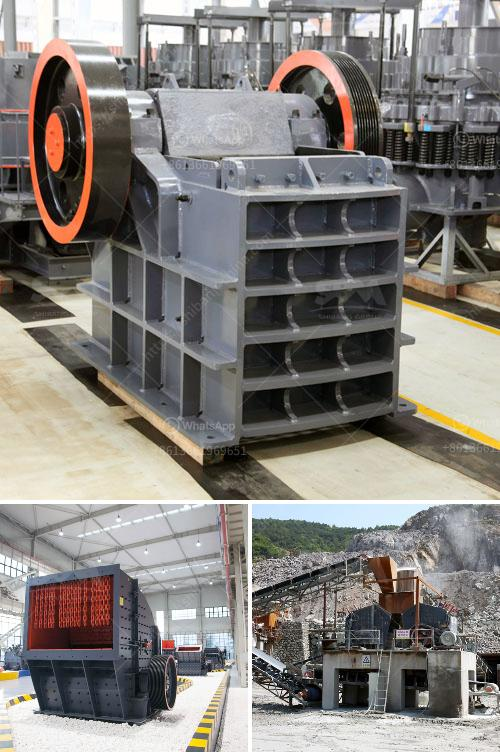

<h3>cement production equipment in germany</h3>
Cement production plays a crucial role in the infrastructure development of any country. Germany, known for its robust engineering and technological advancements, has a leading position in the global cement industry. The country's cement production equipment is a testament to its engineering prowess and commitment to sustainable and efficient manufacturing processes.

Germany boasts a range of cement production equipment that ensures high-quality output while minimizing environmental impact. One notable example is the use of vertical shaft kilns (VSKs) in cement production. VSKs have smaller space requirements and consume less energy compared to traditional rotary kilns. This technology allows for more precise temperature control and reduces emissions of particulate matter, making it an environmentally-friendly choice.

Furthermore, Germany emphasizes the use of alternative fuels in cement production. By harnessing waste materials such as biomass, tires, and industrial residues, the country reduces both its reliance on fossil fuels and waste accumulation. Advanced equipment, such as rotary kilns with precalciners, efficiently process these alternative fuels and contribute to a more sustainable cement production process.

Germany's cement production equipment also focuses on optimizing energy efficiency. Many cement plants in the country employ waste heat recovery systems, allowing them to harness heat from various sources, like exhaust gases or cooling water, for use in the production process. This reduces energy consumption and minimizes greenhouse gas emissions.

In addition to energy efficiency, Germany prioritizes reducing the environmental footprint of cement production through efficient dust collection and filtering systems. By implementing electrostatic precipitators or bag filters, cement plants can effectively capture and contain harmful dust particles, ensuring clean air and safeguarding the health of nearby communities.

Germany's commitment to innovation is evident in its cement production equipment. The country constantly invests in research and development to improve existing technologies and explore new ones. For example, the use of digitalization and automation has enabled real-time monitoring, optimized control systems, and data-driven decision-making. These advancements help maximize production efficiency, reduce downtime, and enhance overall performance.

Moreover, Germany maintains stringent environmental regulations and standards for the cement industry. Equipment manufacturers must comply with these regulations, ensuring that their machinery meets the highest standards of efficiency and environmentally-friendly practices.

Overall, Germany's cement production equipment exemplifies the country's dedication to sustainable and efficient manufacturing processes. By incorporating advanced technologies, optimizing energy efficiency, and prioritizing environmental protection, Germany remains at the forefront of the global cement industry. This commitment not only benefits the country but also sets an example for other nations, encouraging them to adopt similar practices and contribute to a more sustainable future.
<h3>Contact us</h3><ul><li><strong>Whatsapp:&nbsp;<a href="https://wa.me/8613661969651">+8613661969651</a></strong></li><li><a href="https://swt.shibang-china.com/?git&amp;zhl&amp;cement production equipment in germany"><strong>Online Service(chat now)</strong></a></li></ul><h3>Related</h3><ul><li><a href='cost for a bauxite mining company.md'>cost for a bauxite mining company</a></li><li><a href='salvage value of crusher machine.md'>salvage value of crusher machine</a></li><li><a href='mini rock crusher.md'>mini rock crusher</a></li><li><a href='mobile vibrating screens.md'>mobile vibrating screens</a></li><li><a href='500 ton per hr crusher price.md'>500 ton per hr crusher price</a></li></ul>