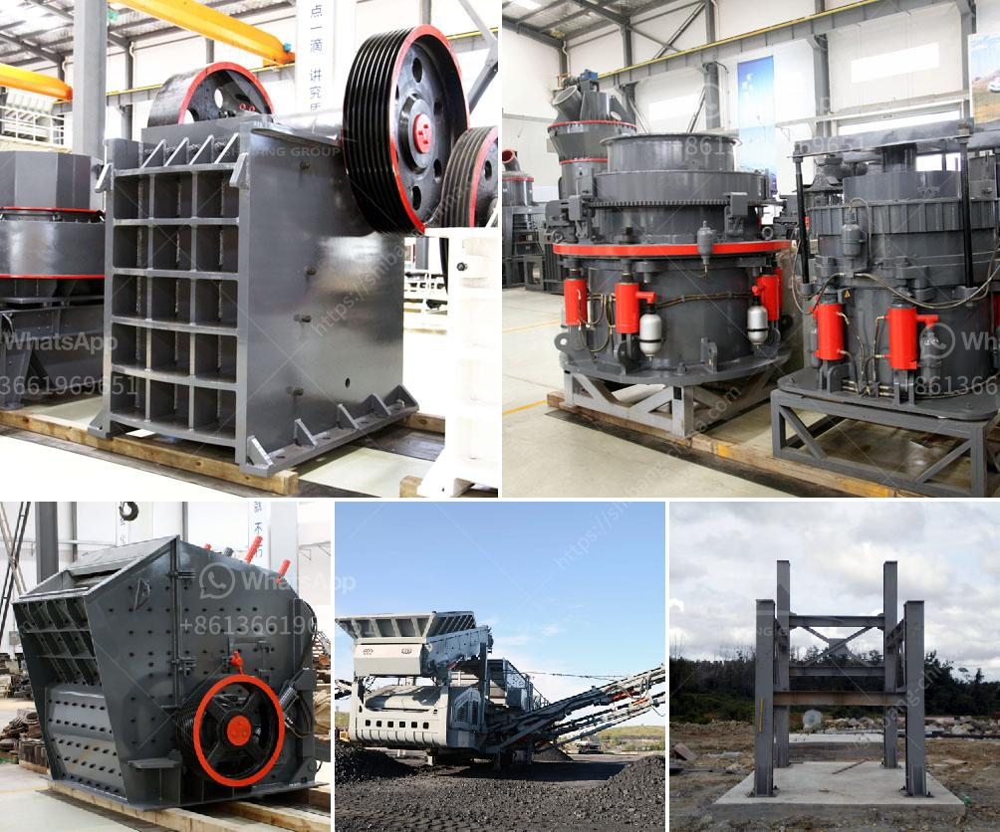

<h3>cement project cost in pakistan</h3>
The construction industry plays a vital role in the development and growth of a country. In Pakistan, the cement industry has emerged as a significant contributor to the economy, as it provides the essential building material for infrastructure projects, residential and commercial complexes, and other construction activities. However, the cost of cement projects in Pakistan is a topic of considerable interest to both investors and consumers alike.

When it comes to determining the cost of a cement project in Pakistan, several factors come into play. These factors include the type and scale of the project, location, labor costs, raw material expenses, transportation costs, and applicable taxes and tariffs. Therefore, it is essential to consider each of these elements to get a comprehensive understanding of the project's cost.

One of the primary determinants of the cost of a cement project is its scale. Large-scale projects, such as constructing a cement plant or establishing multiple factories, tend to involve significant capital investment due to the extensive infrastructure and machinery required. On the other hand, smaller projects like residential or commercial buildings usually have lower costs since they require a lesser amount of cement and involve fewer complexities.

The location of the project also affects its cost. Cement plants or factories situated in remote areas might face additional expenses due to the distance from the raw materials or markets. This entails higher transportation costs, which ultimately impact the overall project cost. Conversely, projects located in close proximity to raw material sources and developed areas may have a cost advantage.

Another crucial factor is labor costs. Pakistan has a vast workforce, and the cost of labor varies across different regions and skillsets. Highly skilled tasks like plant machinery operation and engineering design require specialized workers and may involve higher wages. Furthermore, construction labor, which includes masons, concrete mixers, and laborers, also contributes to project cost.

Raw material expenses, particularly the cost of cement itself, are significant contributors to the project's overall cost. In recent years, cement prices in Pakistan have experienced fluctuations due to varying market dynamics, government policies, and the impact of global factors such as inflation and currency exchange rates. Procuring cement at competitive rates can have a considerable impact on project cost and profitability.

Transportation costs form an integral part of cement project expenses. Cement is usually produced in specific areas or regions and then transported to various locations. The longer the distance between the production site and the project location, the higher the transportation costs. Efficient logistics planning and proximity to cement plants can help mitigate these expenses.

Additionally, it is important to consider taxes and tariffs imposed by the government on cement-related activities. Taxes such as sales tax, customs duties, and excise duties can impact the cost of cement projects. Government policies regarding tax incentives and exemptions may also influence project cost, encouraging or discouraging investment in the sector.

In conclusion, the cost of cement projects in Pakistan is influenced by various factors, including project scale, location, labor costs, raw material prices, transportation expenses, and taxes. Understanding these elements is essential for investors and consumers to make informed decisions and develop a comprehensive cost estimation. While each project is unique, careful consideration and planning can help ensure cost efficiency and successful implementation of cement projects in Pakistan.
<h3>Contact us</h3><ul><li><strong>Whatsapp:&nbsp;<a href="https://wa.me/8613661969651">+8613661969651</a></strong></li><li><a href="https://swt.shibang-china.com/?git&amp;zhl&amp;cement project cost in pakistan"><strong>Online Service(chat now)</strong></a></li></ul><h3>Related</h3><ul><li><a href='slag processing machine in australia.md'>slag processing machine in australia</a></li><li><a href='stone crusher equipment manufacturer made in canada.md'>stone crusher equipment manufacturer made in canada</a></li><li><a href='cocoa processing plant in nigeria.md'>cocoa processing plant in nigeria</a></li><li><a href='pakistan quarry crusher manufacturer.md'>pakistan quarry crusher manufacturer</a></li><li><a href='small rock gravel crushers.md'>small rock gravel crushers</a></li></ul>