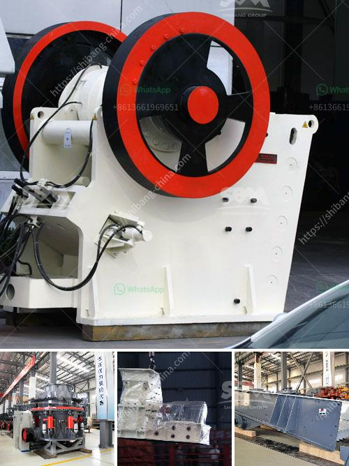

<h3>ceramic various method of crushing and grinding</h3>
Ceramics are a highly versatile material that has been used for centuries in various industries, ranging from construction to healthcare. In order to harness the full potential of ceramics, it is often necessary to crush and grind them into smaller particles. This process can be achieved through various methods, each with its own advantages and limitations.

One of the most common methods of crushing ceramics is through the use of a jaw crusher. This machine uses mechanical pressure to exert force on the ceramic materials and break them into smaller pieces. Jaw crushers are particularly useful when dealing with large quantities of ceramic waste, as they can process materials quickly and efficiently.

Another method of crushing ceramics is through the use of impact crushers. These machines use a high-speed rotating rotor with a hard-wearing surface to deliver a strong impact to the ceramic materials. This impact breaks the ceramics into smaller pieces, which can then be further processed. Impact crushers are generally used for crushing brittle and hard materials, making them ideal for ceramic crushing.

In addition to crushing, grinding is also a crucial process in ceramics processing. Grinding ceramics helps to achieve the desired particle size and shape, as well as improve the overall quality of the ceramic material. There are several methods of grinding ceramics, each with its own advantages and disadvantages.

One common method of grinding ceramics is through the use of a ball mill. This machine uses rotating cylinders filled with ceramic materials and grinding media (such as balls or rods) to grind the ceramics into a fine powder. The result is a finely ground ceramic material that can be further processed or used as desired. Ball mills are particularly suitable for grinding ceramics with high hardness, as the grinding media can exert enough force to break down the hard ceramic particles.

Another method of grinding ceramics is through the use of a vibratory mill. This machine uses vibrations to achieve a grinding effect on the ceramic materials. Vibratory mills are particularly useful for grinding ceramics with low to medium hardness, as the vibrations can effectively break down the ceramic particles without causing excessive wear on the grinding media or the mill itself.

Additionally, some ceramics can be ground using a mortar and pestle. This method involves manually crushing and grinding the ceramics using a pestle (usually made of ceramic or a hard-wearing material) against a mortar (usually made of ceramic or stone). While this method may be time-consuming and physically demanding, it can be useful for grinding small quantities of ceramics or for achieving a specific particle size.

In conclusion, the crushing and grinding of ceramics are essential processes in ceramics processing and production. Various methods, such as using jaw crushers, impact crushers, ball mills, vibratory mills, or even mortar and pestles, can be employed to achieve the desired result. The choice of method will depend on factors such as the size and hardness of the ceramics, the required particle size, and the available equipment. Regardless of the method chosen, careful and precise grinding and crushing of ceramics are crucial for producing high-quality ceramic materials.
<h3>Contact us</h3><ul><li><strong>Whatsapp:&nbsp;<a href="https://wa.me/8613661969651">+8613661969651</a></strong></li><li><a href="https://swt.shibang-china.com/?git&amp;zhl&amp;ceramic various method of crushing and grinding"><strong>Online Service(chat now)</strong></a></li></ul><h3>Related</h3><ul><li><a href='gold wash plant price in nigeria.md'>gold wash plant price in nigeria</a></li><li><a href='china crusher contact australia.md'>china crusher contact australia</a></li><li><a href='conveyor belts in merida.md'>conveyor belts in merida</a></li><li><a href='mineral pulverizer to 300 micron.md'>mineral pulverizer to 300 micron</a></li><li><a href='crushing b series vsi crusher.md'>crushing b series vsi crusher</a></li></ul>