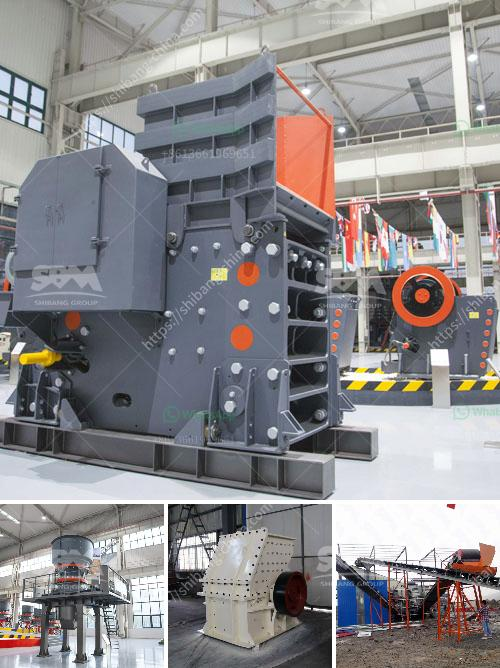

<h3>cheapest crusher machines for sale in kenya</h3>
Are you in the market for a new crusher machine in Kenya? If so, you're probably considering various options, weighing the features and benefits of each. Price is likely a significant factor, and understandably so. Luckily, there are several affordable crusher machines available for sale in Kenya that can meet your crushing needs without breaking the bank.

One option to consider is the manual stone crusher. These are handheld devices that are used for crushing stones manually. They offer a cost-effective method for reducing small stones into smaller sizes for various construction projects. Manual stone crushers are very reliable and can easily be operated even by individuals with little to no experience. They are also durable and require minimal maintenance. Due to their simplicity and affordability, manual stone crushers are widely used in rural areas where electricity may not be readily available, making them an ideal option for cost-conscious buyers.

Alternatively, you might want to explore electric crushers. These are powered by electricity, offering a more efficient and faster crushing process. Electric crushers are suitable for both small-scale and large-scale operations. Due to their higher crushing capacity, they can also handle larger stones. The electric motor eliminates the need for manual labor, making them a preferred choice for users seeking convenient and hassle-free crushing experiences. While electric crushers generally come at a higher price point than manual crushers, they make up for it with their speed and efficiency.

Another affordable option in Kenya is the diesel engine crusher. Diesel-powered crushers are portable and can be easily transported to different job sites. These machines are versatile and can crush various types of stones, including hard rocks. Diesel engine crushers operate with low fuel consumption, making them more cost-effective in the long run. They are also known for their reliability and durability, making them an attractive option for construction companies operating in remote areas with limited access to electricity.

When searching for the cheapest crusher machines for sale in Kenya, it's crucial to consider factors beyond the initial buying price. You should also think about long-term costs, such as maintenance and operational expenses. While some crushers might have a lower purchasing price, they could incur higher costs in terms of spare parts, maintenance, or energy consumption. Therefore, it's essential to assess the overall value each machine offers. Additionally, it's always recommended to seek recommendations or read reviews from previous buyers to ensure you're making an informed decision.

In conclusion, there are several affordable crusher machines available for sale in Kenya. Manual stone crushers, electric crushers, and diesel engine crushers are all viable options, each with its own advantages and suited for different needs. The choice ultimately depends on the specific requirements of your project and your budget.
<h3>Contact us</h3><ul><li><strong>Whatsapp:&nbsp;<a href="https://wa.me/8613661969651">+8613661969651</a></strong></li><li><a href="https://swt.shibang-china.com/?git&amp;zhl&amp;cheapest crusher machines for sale in kenya"><strong>Online Service(chat now)</strong></a></li></ul><h3>Related</h3><ul><li><a href='buy crusher of pact in peru.md'>buy crusher of pact in peru</a></li><li><a href='price of industrial crusher in nigeria.md'>price of industrial crusher in nigeria</a></li><li><a href='stone stone crusher machine malaysia.md'>stone stone crusher machine malaysia</a></li><li><a href='used stone crushers for sale from uae.md'>used stone crushers for sale from uae</a></li><li><a href='used gold stamp mill for sale in south africa.md'>used gold stamp mill for sale in south africa</a></li></ul>