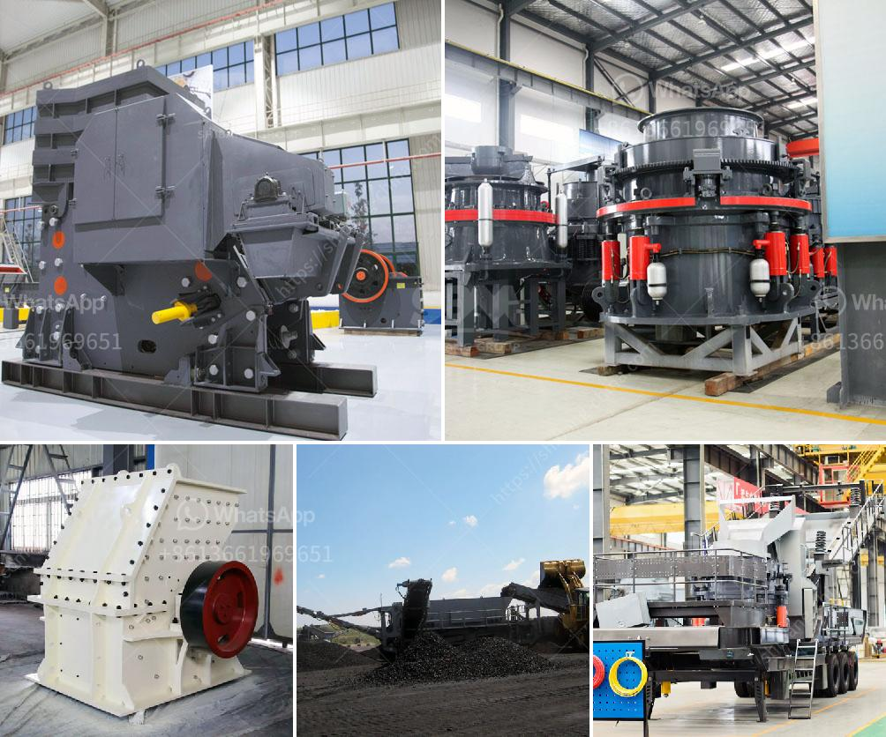

<h3>china clay processing</h3>
China clay, also known as kaolin, is a mineral that is used in various industries such as paper, ceramics, rubber, and cosmetics. It is a soft, white clay that is found in the soil and has a high concentration of kaolinite, a type of clay mineral. The processing of china clay involves several steps and has evolved over time to meet the demands of modern industries.

The first step in the processing of china clay is mining. This involves removing the layer of soil and rocks that cover the clay deposits. China clay is typically found in large open pits, which are excavated using heavy machinery. The extracted clay is then transported to the processing plant, where it undergoes further processing.

Once at the processing plant, the china clay is washed to remove any impurities such as sand, dirt, and rocks. This is done using water and various techniques, such as sedimentation and filtration. The washed clay is then dried to reduce its moisture content, which is crucial for further processing.

After drying, the clay is processed further to remove any remaining impurities and to achieve the desired particle size. This is done through a process called beneficiation, which involves crushing, grinding, and further washing. The aim is to separate the clay particles from other minerals and to obtain a pure and fine product.

The processed china clay is then ready for various industrial applications. In the paper industry, it is used as a filler and coating material, providing smoothness and brightness to the paper. In the ceramics industry, china clay is used to make porcelain and other ceramic products due to its high plasticity and white color. It is also used in the rubber industry to enhance the performance of rubber products and in the cosmetics industry for the production of powders and skincare products.

Over the years, the processing of china clay has undergone advancements to improve efficiency and reduce environmental impact. For example, the use of water recycling systems and advanced filtration techniques has helped conserve water and minimize waste. Additionally, the mining and processing equipment has become more efficient, reducing energy consumption and improving overall productivity.

In conclusion, the processing of china clay is a complex and multi-step process that involves mining, washing, drying, and beneficiation. It is an essential raw material for various industries, including paper, ceramics, rubber, and cosmetics. With advancements in technology and a focus on sustainability, the processing of china clay continues to evolve, meeting the demands of modern industries while minimizing environmental impact.
<h3>Contact us</h3><ul><li><strong>Whatsapp:&nbsp;<a href="https://wa.me/8613661969651">+8613661969651</a></strong></li><li><a href="https://swt.shibang-china.com/?git&amp;zhl&amp;china clay processing"><strong>Online Service(chat now)</strong></a></li></ul><h3>Related</h3><ul><li><a href='small slag crushing plant manufacturers in delhi.md'>small slag crushing plant manufacturers in delhi</a></li><li><a href='advance stone agregate crusher equipments.md'>advance stone agregate crusher equipments</a></li><li><a href='placer mining wash plant operating costs.md'>placer mining wash plant operating costs</a></li><li><a href='jaw crusher mem fr.md'>jaw crusher mem fr</a></li><li><a href='price of stone crusher machine in pakistan.md'>price of stone crusher machine in pakistan</a></li></ul>