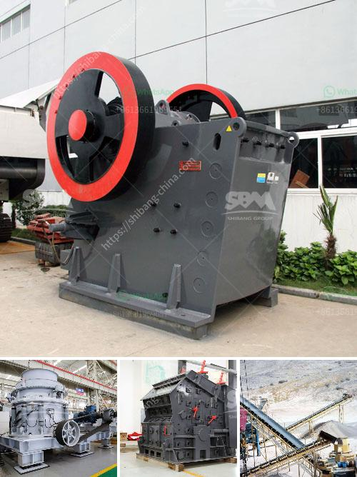

<h3>china crusher contact australia</h3>
In the ever-evolving world of construction and mining, machinery plays a pivotal role in extracting valuable resources from the earth. One country that has made significant strides in this industry is China, a global manufacturing powerhouse. As the world's largest consumer of materials and producer of construction machinery, China continues to dominate the market.

In recent years, China has been expanding its footprint in the global market, seeking strategic partnerships to enhance its machinery offerings. One such partnership that has caught the attention of the Australian market is China Crusher Contact Australia (CCCA). This collaboration aims to bring cutting-edge crushing technologies to the resource-rich country and revolutionize the local crushing industries.

The establishment of CCCA signifies a new era of machinery solutions for Australia. With a wide range of crushers on offer, CCCA is poised to provide the latest advancements in crushing technology to the Australian market. These crushers are designed with efficiency, durability, and environmental sustainability in mind, allowing for the extraction of materials in a more responsible manner. Moreover, the partnership promises to offer after-sales support, spare parts availability, and technical assistance, ensuring uninterrupted operations for customers.

The Australian mining and construction sectors stand to benefit immensely from CCCA's arrival. The crushers offered by CCCA are known for their high productivity and robustness, making them ideal for demanding applications. They can efficiently crush various materials, including hard rock, ores, and minerals, facilitating the extraction process. This will not only improve production efficiency for Australian companies but also reduce operational costs significantly.

Furthermore, CCCA's entry into Australia will foster healthy competition in the crushing machinery market, providing customers with a wider range of choices. The competition will incentivize manufacturers to continually innovate and improve their offerings, ultimately benefiting end-users. In addition, increased access to international technology and expertise will bolster Australia's local manufacturing capabilities.

The China Crusher Contact Australia partnership is an exciting development that promises to reshape the Australian crushing industries. By leveraging China's cutting-edge technologies and Australia's rich reservoirs of resources, this collaboration has the potential to revolutionize the sector. As both countries strive for sustainable and responsible resource extraction, CCCA's entry into the Australian market is a step in the right direction.

In conclusion, the partnership between China Crusher Contact Australia and the Australian crushing industries marks a significant milestone in the global machinery market. This collaboration aims to provide access to advanced crushing technologies, enhance productivity, and foster healthy competition. With its commitment to after-sales support and technical assistance, CCCA is well-positioned to establish itself as a trusted partner for the Australian mining and construction sectors, bringing about positive change in the industry.
<h3>Contact us</h3><ul><li><strong>Whatsapp:&nbsp;<a href="https://wa.me/8613661969651">+8613661969651</a></strong></li><li><a href="https://swt.shibang-china.com/?git&amp;zhl&amp;china crusher contact australia"><strong>Online Service(chat now)</strong></a></li></ul><h3>Related</h3><ul><li><a href='machines de crushine primaires.md'>machines de crushine primaires</a></li><li><a href='roller mill diagram.md'>roller mill diagram</a></li><li><a href='sand mining equipment malaysia.md'>sand mining equipment malaysia</a></li><li><a href='sell stone crusher.md'>sell stone crusher</a></li><li><a href='safety operation of crusher.md'>safety operation of crusher</a></li></ul>