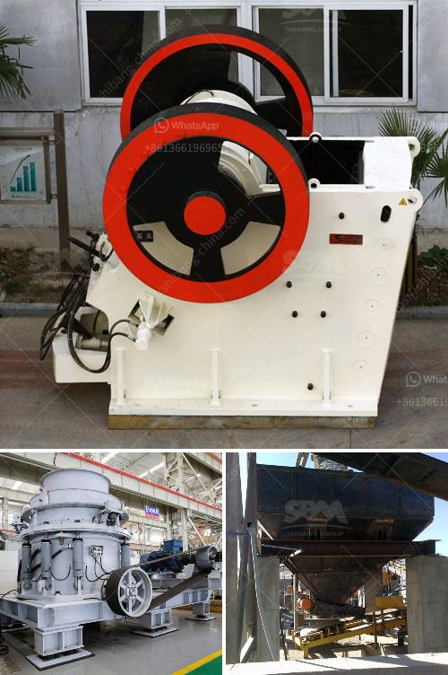

<h3>china crusher plant</h3>
China has a vast territory and abundant resources. Its geographical location and economic development level also dictate the choice of a crusher plant. If you have a low budget and a small space to install the crusher plant, you should choose a small-size crusher plant. However, if your funds are limited, then you can also consider buying a used crusher machine.

In terms of environment protection, the Chinese government has been encouraging the development of green and low-carbon economy. Therefore, in recent years, China has focusing on the development of sustainable and eco-friendly crusher plants. Notably, the Chinese government has been supporting the development of the circular economy and vigorously promoting the recycling economy.

In the crushing industry, the belt conveyor machine widely used to transport loose materials or items, suitable for all kinds of hard and soft ore, such as: limestone, calcite, dolomite, barite, talc calcium, carbonate, gypsum bentonite ,glass and so on.

If your stone crushing size is 0-3mm, hammer crusher is your best choice. The performance advantages of hammer crusher is that it can achieve fine stone crushing process, the turning of maximum size of 600-1800 mm stone material to 25 or 25 mm below. Hammer crusher is suitable for crushing medium hard stone material in cement, chemical, electric power, metallurgy materials, such as limestone, slag, coke, coal and other materials.

Large Size Gyratory Crusher Product experts can only give feedback according to the purchase of previous users. Give a reference price, model PE600 × 900 Large Size Gyratory Crusher Product, market price is about 125,000, model is relatively large, the price is relatively high, so the customer in the process of purchase, when the buy Large Size Gyratory Crusher Product, perhaps not very understanding, can be defaulted to "factory price negotiation" Model List.

To sum up, the above analysis of the productivity of the crawler-type mobile crushing station and the tire-type mobile crushing station, it can be seen that these two types of crushing stations have technical advantages in terms of stability, productivity, and environmental protection.
<h3>Contact us</h3><ul><li><strong>Whatsapp:&nbsp;<a href="https://wa.me/8613661969651">+8613661969651</a></strong></li><li><a href="https://swt.shibang-china.com/?git&amp;zhl&amp;china crusher plant"><strong>Online Service(chat now)</strong></a></li></ul><h3>Related</h3><ul><li><a href='industrial hammer mill malaysia.md'>industrial hammer mill malaysia</a></li><li><a href='granite quarry plant in sri lanka.md'>granite quarry plant in sri lanka</a></li><li><a href='crushing and mining equipment companies in uae.md'>crushing and mining equipment companies in uae</a></li><li><a href='gypsum grinding mill for chalk factory.md'>gypsum grinding mill for chalk factory</a></li><li><a href='crushing production line in equipment.md'>crushing production line in equipment</a></li></ul>