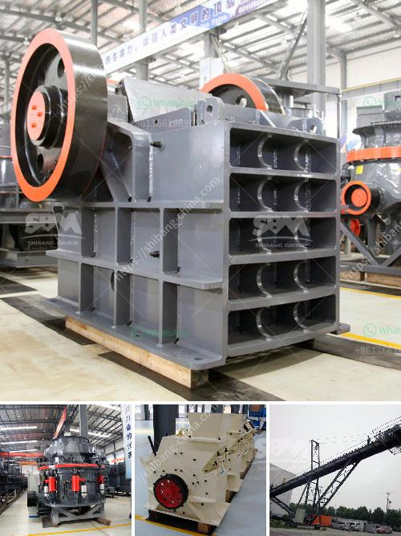

<h3>china crushing plant</h3>
China has always been a country known for its industrial prowess and massive infrastructure development. As the world's largest producer and consumer of various products, it is crucial for China to have an efficient system for crushing plants. These plants are vital in processing raw materials and producing aggregates, which are essential components in various construction projects.

A crushing plant is a large one-stop facility used to break the raw materials into smaller pieces before they are transported for further processing. This process is essential in the construction industry, as it helps in producing materials like concrete, asphalt, and cement. Additionally, it is also used in the mining industry to extract valuable metals and minerals from the earth.

In China, crushing plants typically range from 300 to 500 tons per hour. To ensure optimal efficiency and productivity, these plants are equipped with advanced machinery, including vibrating feeders, jaw crushers, impact crushers, vibrating screens, and belt conveyors. These components work together to break down the raw materials effectively and efficiently.

China's crushing plants are strategically located in areas with abundant raw materials, such as limestone, granite, and basalt. These materials are widely available across the country, ensuring a constant supply for the crushing plants. Furthermore, the strategic placement of these plants near construction sites minimizes transportation costs and reduces environmental impacts.

One of the notable crushing plants in China is the Shanghai Shibang Machinery Co., Ltd. (SBM) crushing plant. SBM is a renowned manufacturer and supplier of high-quality crushing equipment. Their crushing plant is equipped with advanced technology and has a production capacity of 400-500 tons per hour. The plant is strategically located in Shanghai, which allows for easy access to both domestic and international markets.

China's crushing plants also prioritize environmental sustainability. The government has implemented strict regulations to control air and water pollution generated by these plants. They require the installation of advanced dust control systems, water recycling systems, and noise reduction measures. The Chinese government encourages the use of energy-efficient equipment and the adoption of cleaner production techniques to minimize the ecological footprint of these plants.

In addition to the environmental benefits, China's crushing plants also contribute significantly to the country's economy. These plants generate employment opportunities for thousands of workers directly and indirectly. Furthermore, the production of aggregates and other construction materials supports the booming construction industry in China. It plays a vital role in the rapid urbanization and infrastructure development that the country has been experiencing in recent years.

In conclusion, China's crushing plants are a key component of the country's industrial and construction sectors. With advanced technology, strategic locations, and environmental sustainability measures, these plants efficiently process raw materials to produce aggregates for various construction projects. They contribute to the nation's economic growth while minimizing environmental impacts. As China continues to prioritize infrastructure development, the demand for crushing plants is expected to remain high, driving further advancements in this industry.
<h3>Contact us</h3><ul><li><strong>Whatsapp:&nbsp;<a href="https://wa.me/8613661969651">+8613661969651</a></strong></li><li><a href="https://swt.shibang-china.com/?git&amp;zhl&amp;china crushing plant"><strong>Online Service(chat now)</strong></a></li></ul><h3>Related</h3><ul><li><a href='stasioner stone crusher.md'>stasioner stone crusher</a></li><li><a href='100tpd cement plant project cost.md'>100tpd cement plant project cost</a></li><li><a href='mobile crusher plants.md'>mobile crusher plants</a></li><li><a href='limestone crushing process.md'>limestone crushing process</a></li><li><a href='enquiry about crushing machine.md'>enquiry about crushing machine</a></li></ul>