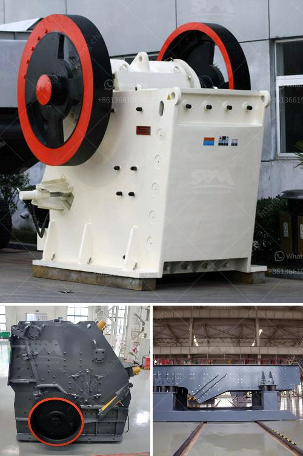

<h3>china limestone jaw crusher machine</h3>
China limestone jaw crusher machine is a commonly used crushing equipment in mining industry. It is mainly used for the coarse crushing and secondary crushing of hard materials such as limestone and granite. Many customers in China purchase limestone jaw crushers and use them in their production lines. The output of these machines is high, the efficiency is high, and the price is relatively favorable, making them a popular choice in the market.

The limestone jaw crusher machine in China adopts the optimized moving jaw structure in order to ensure the smooth movement and reliable operation. Its unique crushing cavity design can significantly increase the crushing ratio and output. The jaw crusher is equipped with a hydraulic discharge opening adjusting device, which simplifies the adjustment of the discharge opening, saves time and effort, and ensures the operation is more convenient and efficient.

The China limestone jaw crusher machine is equipped with a double-wedge discharge opening adjustment system, which can flexibly adjust the discharge opening size and easily control the particle size of the finished product. The unique flywheel design reduces the vibration and makes the machine more stable during operation. In addition, the machine is equipped with a centralized lubrication system, which ensures the reliable lubrication of the bearings and extends their service life.

The China limestone jaw crusher machine is driven by a motor through a belt wheel, making the movable jaw plate move along a certain trajectory. When the material enters the crushing chamber, it is crushed by the impact of the fixed jaw plate and the movable jaw plate. With the continuous rotation of the motor, the materials are crushed and discharged from the discharge opening.

In summary, the China limestone jaw crusher machine is a powerful crushing equipment that is both reliable and efficient. With a strong production capacity, it is suitable for large-scale operations. Its high crushing ratio and adjustable discharge opening size make it highly versatile, meeting the needs of various customers. Whether it is used in mining, construction, or other industries, this machine is a great choice for crushing hard materials and improving productivity.
<h3>Contact us</h3><ul><li><strong>Whatsapp:&nbsp;<a href="https://wa.me/8613661969651">+8613661969651</a></strong></li><li><a href="https://swt.shibang-china.com/?git&amp;zhl&amp;china limestone jaw crusher machine"><strong>Online Service(chat now)</strong></a></li></ul><h3>Related</h3><ul><li><a href='impact crusher manufacturers in saudi.md'>impact crusher manufacturers in saudi</a></li><li><a href='price a stone crusher in peru.md'>price a stone crusher in peru</a></li><li><a href='crusher impact germany.md'>crusher impact germany</a></li><li><a href='gypsum grinding mill for chalk factory.md'>gypsum grinding mill for chalk factory</a></li><li><a href='quotation for crusher.md'>quotation for crusher</a></li></ul>