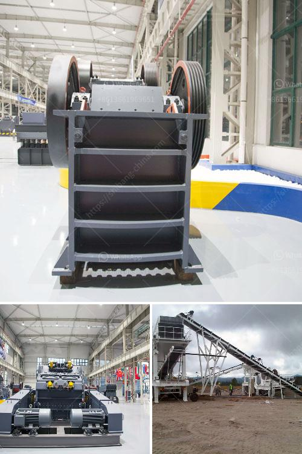

<h3>china pasir harga washing plant</h3>
In recent years, China has experienced rapid economic growth, leading to a surge in demand for construction materials, including sand. The mining of sand, however, has come under scrutiny due to its environmental impact. To address this concern, China Pasir Harga Washing Plant has emerged as a solution that not only fulfills the demand for sand but also promotes sustainable development in the mining industry.

China Pasir Harga Washing Plant is a revolutionary concept that focuses on washing and purifying sand to meet the required standards. By utilizing advanced technology and equipment, this washing plant ensures that sand extracted from mining sites is cleaned and processed, eliminating impurities and harmful substances in the process. This not only improves the quality of sand but also minimizes its environmental impact.

One of the key benefits of China Pasir Harga Washing Plant is the reduction of water and energy consumption in the mining industry. Traditional methods of sand extraction involve the use of large volumes of water to wash the sand, leading to high water consumption and wastage. However, this washing plant utilizes a closed-loop system, recycling and reusing water, significantly reducing water consumption. Additionally, the plant adopts energy-efficient technologies, lowering overall energy consumption and promoting sustainability.

Moreover, China Pasir Harga Washing Plant focuses on minimizing the environmental footprint of the mining activities. By removing impurities, such as clay, silt, and organic matter, this plant prevents the contamination of water bodies and surrounding ecosystems. It also reduces dust pollution, which is a common issue in sand mining operations. This environmentally-friendly approach not only protects the natural resources but also ensures the long-term sustainability of the mining industry.

Another advantage of China Pasir Harga Washing Plant is its contribution to the local economy. The establishment of this plant creates job opportunities, providing employment to local communities. It also boosts the local economy through the purchase of raw materials, equipment, and services. By supporting the growth of the mining industry in a sustainable manner, it improves the socio-economic well-being of the region.

Furthermore, this washing plant emphasizes the importance of responsible mining practices. It adheres to strict regulations and standards, ensuring that the extraction and processing of sand are carried out in an ethical and transparent manner. China Pasir Harga Washing Plant also promotes collaboration with local communities, encouraging dialogue and engagement to address any concerns or issues related to mining activities.

In conclusion, China Pasir Harga Washing Plant represents a significant step towards sustainable development in the mining industry. By implementing advanced technologies, minimizing water and energy consumption, reducing environmental impact, promoting local economic growth, and advocating responsible mining practices, this washing plant sets a benchmark for the sand mining sector. It not only meets the growing demand for sand but also ensures the long-term viability of this vital industry while safeguarding the environment and benefiting the local communities.
<h3>Contact us</h3><ul><li><strong>Whatsapp:&nbsp;<a href="https://wa.me/8613661969651">+8613661969651</a></strong></li><li><a href="https://swt.shibang-china.com/?git&amp;zhl&amp;china pasir harga washing plant"><strong>Online Service(chat now)</strong></a></li></ul><h3>Related</h3><ul><li><a href='stone crusher machine china.md'>stone crusher machine china</a></li><li><a href='crushing machine in.md'>crushing machine in</a></li><li><a href='stone crusher plant kapasitas 60 ton h.md'>stone crusher plant kapasitas 60 ton h</a></li><li><a href='stasioner stone crusher.md'>stasioner stone crusher</a></li><li><a href='quartz marble making machine.md'>quartz marble making machine</a></li></ul>