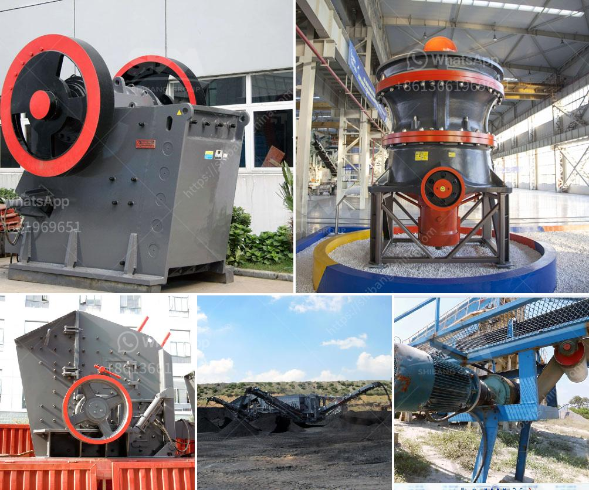

<h3>china portable crusher</h3>
In recent years, China's economy has experienced rapid growth, contributing to the rise of the construction industry. As a result, the demand for construction materials has skyrocketed, including the need for aggregates, crushed stones, and rocks.

To meet this growing demand, China has embraced the use of portable crushers. These innovative machines have revolutionized construction site operations, providing faster and more efficient ways to process and produce materials.

One of the key advantages of using a portable crusher is its flexibility. Traditional crushers require fixed installation, making it challenging to relocate and operate in multiple locations. However, portable crushers are designed to be mobile, allowing easy transportation between different sites. This versatility is crucial for construction projects that require on-site crushing, such as road construction, demolition, and mining operations.

Another significant benefit of portable crushers is their high productivity and efficiency. Equipped with cutting-edge technology, these machines can crush large rocks into various sizes within minutes. They can process different types of materials, from hard granite to soft limestone, with ease. This increased efficiency reduces labor costs, time, and energy consumption, making portable crushers a cost-effective solution for construction companies.

Furthermore, China's portable crushers are designed to be environmentally friendly. The advanced dust control systems integrated into these machines effectively suppress dust emissions, minimizing air pollution. Additionally, they come equipped with noise reduction features, ensuring a quieter working environment. These eco-friendly attributes make portable crushers an ideal choice for sustainable construction projects.

The durability and reliability of China's portable crushers also contribute to their popularity. Built with robust materials and components, these machines can withstand harsh conditions and operate efficiently for extended periods. Their sturdy construction ensures minimal downtime and maintenance requirements, maximizing workflow and reducing project delays.

China has recognized the growing importance of portable crushers and has invested in research and development, resulting in continuous technological advancements. These innovations have led to improved performance, increased safety features, and enhanced user experience. Manufacturers are consistently incorporating the latest developments into their designs, making portable crushers even more efficient and user-friendly.

While China's portable crushers have dominated the domestic market, their reputation is also growing on the global stage. Chinese manufacturers have expanded their reach and exported these machines to numerous countries, providing them with cutting-edge crushing technology. This global outreach showcases China's ability to produce world-class equipment, cementing its position as an international leader in the construction industry.

In conclusion, China's portable crushers have revolutionized the construction industry by providing faster, more efficient, and eco-friendly ways to process and produce materials. Their mobility, high productivity, and durability have made them an indispensable tool for construction projects worldwide. With continuous technological advancements, China's portable crushers will continue to shape the future of crushing technology, further elevating the nation's status as an industry leader.
<h3>Contact us</h3><ul><li><strong>Whatsapp:&nbsp;<a href="https://wa.me/8613661969651">+8613661969651</a></strong></li><li><a href="https://swt.shibang-china.com/?git&amp;zhl&amp;china portable crusher"><strong>Online Service(chat now)</strong></a></li></ul><h3>Related</h3><ul><li><a href='coal screening machine in india.md'>coal screening machine in india</a></li><li><a href='staalmeester hammer mills.md'>staalmeester hammer mills</a></li><li><a href='thailand coconut processing machine.md'>thailand coconut processing machine</a></li><li><a href='sand screening machine south africa.md'>sand screening machine south africa</a></li><li><a href='gypsum powder ball mill machinery.md'>gypsum powder ball mill machinery</a></li></ul>